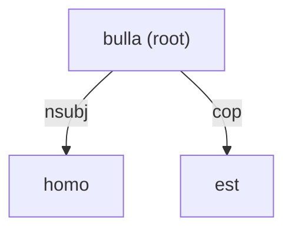

# Varro RR Annotation Guidelines

> **Work in progress, 23 September 2026.** This document sets out the full nine-chapter structure of the Varro RR annotation manual, with prose drafted throughout. It is not yet a release-authoritative specification.

## Contents

1. [Introduction](#1-introduction)
   1. [Scope of the treebank](#11-scope-of-the-treebank)
   2. [Annotation layers and their CoNLL-U representation](#12-annotation-layers-and-their-conll-u-representation)
   3. [Key concepts](#13-key-concepts)
   4. [Sources of authority](#14-sources-of-authority)
   5. [How to use these guidelines](#15-how-to-use-these-guidelines)
2. [CoNLL-U format and project serialization](#2-conll-u-format-and-project-serialization)
3. [Lemmas and parts of speech](#3-lemmas-and-parts-of-speech)
4. [Morphological features](#4-morphological-features)
5. [Basic syntax](#5-basic-syntax)
6. [Enhanced syntax](#6-enhanced-syntax)
7. [Latin and Varronian constructions](#7-latin-and-varronian-constructions)
8. [Text, variation, and discourse metadata](#8-text-variation-and-discourse-metadata)
9. [Review status and provenance](#9-review-status-and-provenance)

---

## 1. Introduction

### 1.1 Scope of the treebank

The Varro RR treebank provides a morphologically and syntactically annotated representation of Varro's *Res rusticae*. Its primary annotation framework is Universal Dependencies (UD), supplemented by harmonized Latin conventions and a limited set of explicit project decisions required by the text, the research questions, or the practicalities of review.

This choice of framework continues a specific line of prior work rather than starting from a blank slate: dependency-based treebanking for Ancient Greek and Latin, developed from the 1990s onward within the Prague School tradition and continued by the Ancient Greek and Latin Dependency Treebank (AGLDT) and its Perseus-associated successors, more recently converted into and harmonized under Universal Dependencies. The project draws on both traditions rather than treating UD as a self-sufficient theoretical starting point: categories and interpretive habits inherited from the older, more philologically oriented Prague/AGLDT tradition inform decisions wherever UD's own guidance is underspecified for Latin.

The treebank represents more than a sequence of dependency trees. Its CoNLL-U records may also preserve textual normalization, editorial variants, alternative analyses, speaker and discourse information, review notes, review status, and selected linguistic observations that cannot be recovered economically from ordinary dependency queries alone.

The purpose of these guidelines is to explain that combined system as a coherent annotation model, organized by linguistic topic.

### 1.2 Annotation layers and their CoNLL-U representation

The project distinguishes conceptual annotation layers, but stores them together in CoNLL-U records. A single token row may therefore carry lexical, morphological, Basic-syntactic, Enhanced-syntactic, provenance, and project-specific information.

At a first approximation:

- sentence-level text, identity, status, and provenance are stored in comment lines beginning with `#`;
- tokenization is represented primarily by `ID` and `FORM`;
- lexical analysis is represented primarily by `LEMMA` and `UPOS`;
- morphological analysis is represented primarily by `FEATS`;
- Basic dependency syntax is represented by `HEAD` and `DEPREL`;
- Enhanced dependency syntax is represented by `DEPS`;
- token-level project metadata is represented by `MISC`.

This mapping is introduced here so that the conceptual layers remain connected to the file format throughout the manual. Section 2 gives the full serialization reference.

#### 1.2.1 Text and sentence metadata

Sentence metadata is written as comment lines before the token rows. Typical examples include:

```conllu
# sent_id = S000001
# edition_loc = 1.1.1
# text = otium si essem consecutus, Fundania, ...
# review_status = silver
# speaker = Narrator
```

Sentence metadata is serialized as `# key = value` comments; it is not a numbered CoNLL-U field.

#### 1.2.2 Tokenization and lexical representation

The first five CoNLL-U fields are:

```text
ID    FORM    LEMMA    UPOS    XPOS
```

`ID` identifies ordinary syntactic words, multiword-token ranges, or decimal-ID empty nodes. `FORM` records the accepted surface token, `LEMMA` its lemma, and `UPOS` its Universal Part-of-Speech category. `XPOS` is not used as an independent project tagset and is normally `_`.

Tokenization decisions are part of the annotation. A change in token boundaries may renumber every later token in the sentence and therefore affects dependency references as well as forms.

#### 1.2.3 Morphological annotation

Morphological features are stored in `FEATS` as alphabetically ordered `Feature=Value` pairs separated by vertical bars:

```conllu
Case=Acc|Gender=Neut|InflClass=IndEurO|Number=Sing
```

Some morphology-related compatibility metadata is stored in `MISC` rather than `FEATS`. In particular, `TraditionalMood` and `TraditionalTense` preserve traditional Latin categories alongside the harmonized UD feature analysis. Their storage location does not make them discourse or review features: `MISC` is a serialization field containing several conceptually different kinds of metadata.

#### 1.2.4 Basic dependency syntax

Basic dependency syntax is stored in:

```text
HEAD    DEPREL
```

Every syntactic-word row has one Basic governor, except that the sentence root is governed by the virtual root node `0`. `HEAD` gives the governor's token ID and `DEPREL` gives the relation between the dependent and that governor.

The Basic layer is a tree. It therefore requires one root and one incoming Basic relation per syntactic word. Where ellipsis or sharing makes the linguistic structure richer than a single tree can express, the Basic layer selects one structural analysis and the Enhanced layer may add further information.

#### 1.2.5 Enhanced dependency syntax

Enhanced dependency syntax is stored in `DEPS`. Unlike the Basic layer, the Enhanced representation may form a graph: a token may have more than one incoming relation, and decimal-ID empty nodes may represent elided predicates or other reconstructed structure where project policy licenses them.

Enhanced syntax does not replace the Basic tree. It adds information that the Basic representation cannot encode without violating its single-head structure.

#### 1.2.6 Project metadata and analytical notes

Token-level project metadata is stored in `MISC`. Important categories include:

- textual history, such as `OrigForm`;
- editorial variation, such as `Variant`;
- speaker and discourse information, such as `Speaker` and `DiscourseMode`;
- references to retained reasoning, such as `ReviewNote` and `ReviewTags`;
- special-construction labels, such as `SyntaxNote`;
- compatibility and provenance information, such as `InheritedFrom`;
- temporary review markers.

These attributes share a storage field but do not form one linguistic layer. Each is governed by its own definition and lifecycle.

### 1.3 Key concepts

#### 1.3.1 Dependencies, headedness, and flat structures

Dependency annotation represents a construction by identifying a head and attaching its dependents to it with labelled relations. The first question is therefore not which label to choose, but which element organizes the construction syntactically.

A head is not necessarily:

- the first word;
- the finite verb;
- the morphologically richest word;
- the word named first in traditional grammar;
- the word translated by an English verb.

Ordinary dependencies are used wherever a syntactic head can be identified. A flat structure is appropriate only where no component is an adequate internal head, or where an applicable annotation convention deliberately treats the components as structurally parallel.

In UD relations such as [`flat`](https://universaldependencies.org/u/dep/flat.html), `flat:name`, and `flat:foreign`, the first component is used as the technical head by convention. This does not assert that it is semantically more important than the following components. In `flat:gov`, the conventional first-word headedness may even stand in explicit tension with the second element's semantic prominence.

This use of *flat* is specific to UD and does not correspond directly to every Prague-style treatment of coordination, apposition, multiword expressions, or formally headless constructions. Comparisons with PDT-style annotation are explanatory aids, not conversion rules.

An internal head is sought before any flat relation is applied: apparent unity of meaning, naming function, or idiomaticity is not by itself evidence for flatness.

#### 1.3.2 Predication in dependency grammar

A predicate is the syntactic centre of a predication. It is not necessarily a finite verb.

This differs from several traditional uses of *predicate* and *predicative*. Traditional grammar may use *predicate* for everything said about a subject, or may assume that a finite verb heads the clause because it carries person, tense, and mood. It may use *predicative* for several formally similar constructions that dependency grammar distinguishes structurally.

In these guidelines, predicate identification is a head-selection problem. The clause predicate may be:

- a lexical verb;
- an adjective in a nonverbal predication;
- a noun in an identity or classification predication;
- an adverb or adpositional expression functioning as the primary predication;
- a promoted surviving element when the semantic predicate is elided.

Traditional terminology provides useful evidence, but it does not map mechanically to dependency relations. A traditional “predicative” may correspond to a primary nonverbal predicate, a selected predicative complement, an optional secondary predicate, an apposition, or an attributive modifier, and the annotation identifies which structure is actually present.

Existential and presentational clauses require particular care. Neither of the following inferences is sufficient:

```text
form of sum → therefore sum is a copula
traditional existential label → therefore sum must be a lexical root
```

What matters is what is being predicated and what contribution *sum* makes in the clause. Depending on the construction, a form of *sum* is ordinarily a pure copula or a verbal auxiliary; a genuine existential or lexical use exists but is rare (see Section 1.3.3).

#### 1.3.3 Nonverbal predication and the copula

In a pure nonverbal predication, the nonverbal predicate heads the clause. A pure copula is attached to that predicate with [`cop`](https://universaldependencies.org/u/dep/cop.html); a verbal copula is tagged `AUX`, not `VERB`.

A simplified example is:

```conllu
1	homo	homo	NOUN	_	Case=Nom|Gender=Masc|Number=Sing	3	nsubj	_	_
2	est	sum	AUX	_	Mood=Ind|Number=Sing|Person=3|Tense=Pres|VerbForm=Fin	3	cop	_	_
3	bulla	bulla	NOUN	_	Case=Nom|Gender=Fem|Number=Sing	0	root	_	_
```



Here:

- `bulla` is the predicate and root;
- `homo` is its subject;
- `est` supports the predication as `cop`;
- the finite copula is not the clause head merely because it carries verbal morphology.

A practical two-way distinction is:

```text
Pure nonverbal predication
    nonverbal predicate is head; sum is AUX with cop

Periphrastic verbal construction
    lexical verbal form is head; sum is AUX with aux or aux:pass
```

This is not a lemma-based classification: the same surface form is analysed according to its function in the particular clause.

> **Note.** A genuine existential *sum* — a content word translating as "exist," predicating nothing else, not even an elided element — is extremely rare in Classical Latin. Cicero's *omnium qui sunt, qui fuerunt, qui futuri sunt* (*Fam.* 11.21.1) is a clear instance. The perfect forms *fuit*, *fuerunt*, and similar also occur euphemistically for "he is" / "they are dead," and a relative-clause-subject construction such as *sunt qui putant posse te non decedere* (*Fam.* 1.9.25) becomes more frequent in Late Latin. Other instances traditionally labelled "existential," including in some PDT-style dependency schemes, are otherwise analysable as nominal predication with a copula, sometimes with a clause as the predicating element.

#### 1.3.4 Secondary predication

Secondary predication adds another predication to a clause without replacing its primary predicate. It commonly expresses a state, role, or circumstance that holds of a participant while the main event or state holds.

The concept is broader than any one dependency relation. The most important distinctions are:

**Optional secondary predication**

An optional secondary predicate is an adjunct. In the project it is typically represented by `advcl:pred`. The clause remains structurally complete without it.

**Selected predicative complement**

A predicate may require or select another predication. Where the understood subject of that complement is obligatorily controlled by a matrix argument, the analysis is typically `xcomp`, not `advcl:pred`.

**Absolute secondary predication**

An ablative absolute brings its own subject and is represented by `advcl:abs`. Its independence from the main clause's arguments distinguishes it from ordinary secondary predication.

**Attributive or identifying modification**

An adjective, participle, or noun may characterize or identify a nominal rather than assert a circumstance holding of it in the clause. Such structures take relations such as `amod`, `acl`, or `appos`, depending on their form and function.

The morphology of attributive and secondary-predicative expressions may be identical, so the distinction cannot be read off agreement alone: it depends on whether the expression characterizes the nominal or contributes an additional predication to the clause.

#### 1.3.5 Arguments, complements, and adjuncts

A predicate's arguments are participants or propositions selected by its lexical or constructional requirements. Adjuncts add optional circumstances such as time, place, manner, cause, or condition.

This distinction underlies several important relation choices:

- `obj` versus `obl`;
- `obl:arg` versus plain `obl`;
- `ccomp` or `xcomp` versus `advcl`;
- `xcomp` versus `advcl:pred`;
- selected locatives versus ordinary locative modifiers.

Morphological case and semantic plausibility do not settle argument status on their own: it instead depends on the governor's valency and on whether the dependent is required or selected in that construction.

#### 1.3.6 Overt, omitted, and reconstructed structure

Latin frequently leaves material unexpressed, and dependency annotation distinguishes several different situations:

- an ordinary null subject recoverable from verbal morphology;
- an omitted copula that does not require structural reconstruction;
- an ellipsis that leaves all surviving elements with ordinary governors;
- head ellipsis that strands dependents and requires promotion with `orphan`;
- an Enhanced reconstruction that licenses a decimal-ID empty node;
- a physical gap in the transmitted text.

Not every understood element is represented by an empty node, and not every clause without an overt finite verb contains an ellipsis requiring reconstruction. The deciding factor is what structure is needed to represent the surviving relations without distortion.

A promoted element under ellipsis may become the Basic root even though it is not the semantic predicate. This is a structural repair required by the tree format, not a claim that the promoted word has become a lexical predicate.

#### 1.3.7 Annotation criteria and illustrative examples

Definitions and stated criteria determine what an annotation category licenses. Examples illustrate those criteria but do not define their limits.

Accordingly:

- the absence of a construction from the examples does not make it unlicensed;
- the presence of several examples does not turn them into a closed inventory;
- corpus frequency does not determine grammatical availability;
- current non-attestation may reflect the reviewed range rather than the language;
- a rule remains interpretable even with every example removed.

Examples follow from the governing criterion rather than preceding it. An uncertain case remains open rather than being settled by treating a precedent as an automatic answer.

### 1.4 Sources of authority

The project distinguishes four kinds of authority:

1. **General Universal Dependencies**, governing the cross-linguistic framework and the CoNLL-U format.
2. **Latin Universal Dependencies**, governing Latin-specific features, relations, and documented conventions.
3. **Harmonized Latin annotation**, used where a shared Latin-treebank convention has been adopted across relevant resources.
4. **Project-specific decisions**, used only where the project deliberately chooses or defines a convention not settled by the preceding levels.

The current reference works for the harmonized-Latin tier are Gamba and Zeman's cross-treebank harmonization of Latin syntax (2023a) and of Latin morphology (2023b).

Project-specific decisions do not silently override UD: a deliberate deviation is stated as such, scoped narrowly, and given a rationale rather than left implicit. Parser output, corpus frequency, and precedent function as evidence rather than authority.

Where sources conflict, precedence follows the ordering above, from general Universal Dependencies down to project-specific decisions.

This project's own comparison of candidate Latin parsing systems, run against the reviewed silver corpus, found that the strongest system led on every measured metric — lemmatization, part-of-speech tagging, morphology, and both unlabelled and labelled attachment — while still failing on roughly a fifth of tokens; "best of the candidates" is not "reliable by default." The more consequential finding concerned the candidates jointly rather than individually: their errors are substantially correlated rather than statistically independent, so that on a token where the strongest system is wrong, the others' own accuracy drops sharply as well, well beyond what independent failure rates would predict. Agreement across systems is accordingly read as informative but never sufficient by itself to settle a genuinely contested reading, and parser evidence is not consulted at all for a construction already known to require the kind of semantic judgment automated systems handle poorly.

Three systems are retained as ongoing comparative evidence on this basis, each assigned a distinct evidential role rather than an equal vote: EvaLatin24 (LatinPipe), the strongest general performer, retained as the primary witness for ordinary syntax and morphology comparison; CIRCSE, weighted specifically for subtype-level questions, where — conditional on already identifying the correct base relation — it selects the correct subtype more reliably than the other two; and Perseus, retained as a general corroborating witness, solid on basic lemmatization and attachment but the weakest of the three on subtype precision. None of the three is ever treated as a direct source of annotation authority in its own right, consistent with the ordering above.

### 1.5 How to use these guidelines

These guidelines move from general principles to specific constructions. Section 1 sets out the conceptual vocabulary — headedness, predication, argument structure, and the treatment of unexpressed material — that later sections presuppose without restating. Sections 2 to 4 cover the file format, lexical categories, and morphological features; Sections 5 and 6 cover Basic and Enhanced syntax; Section 7 brings these together for constructions characteristic of Varro's Latin; Sections 8 and 9 cover textual and provenance metadata. A reader unfamiliar with dependency grammar is best served by reading Section 1 in full before using later sections as reference.

---

## 2. CoNLL-U Format and Project Serialization

Section 1.2 introduced the correspondence between annotation layers and CoNLL-U fields in outline. This section gives the complete serialization reference: how a sentence record is delimited, what each of the ten columns contains, and how project-specific metadata is encoded within the format's own extension points.

### 2.1 Sentence records and blank-line separation

A [CoNLL-U](https://universaldependencies.org/format.html) file is a sequence of sentence records separated by a single blank line. Each record consists of, in order:

- zero or more comment lines, each beginning with `#`, carrying sentence-level metadata;
- one row per syntactic word, multiword-token range, or empty node, in ascending `ID` order;
- no blank lines within the record.

The general CoNLL-U format fixes this structure. The project's own comment-line keys are extensions within it, listed in Section 2.7.

### 2.2 The ten CoNLL-U columns

Each row has exactly ten tab-separated fields:

```text
ID    FORM    LEMMA    UPOS    XPOS    FEATS    HEAD    DEPREL    DEPS    MISC
```

| # | Field | Content |
|---|---|---|
| 1 | `ID` | Word index, multiword-token range, or decimal empty-node index |
| 2 | `FORM` | Accepted surface form |
| 3 | `LEMMA` | Lemma of the form |
| 4 | `UPOS` | Universal part-of-speech category |
| 5 | `XPOS` | Not used as an independent project tagset; normally `_` |
| 6 | `FEATS` | Morphological features |
| 7 | `HEAD` | Basic-dependency governor (the `ID` of the head, or `0` for the sentence root) |
| 8 | `DEPREL` | Basic dependency relation to `HEAD` |
| 9 | `DEPS` | Enhanced dependency graph |
| 10 | `MISC` | Project and format metadata not covered by the preceding fields |

An inapplicable or unspecified field is written as a single underscore, `_`, rather than left empty.

### 2.3 Ordinary syntactic-word rows

An ordinary syntactic-word row has an integer `ID`. `HEAD` and `DEPREL` are always required for such a row; `LEMMA` and `UPOS` are always required; `FEATS`, `DEPS`, and `MISC` take `_` wherever nothing applies to that token.

### 2.4 Multiword-token rows

The format additionally provides for a multiword token: a single orthographic token that corresponds to more than one syntactic word. Its row uses a range `ID` (for example `4-5`), gives the orthographic surface form in `FORM`, and takes `_` in every other field. Each syntactic word within the range then receives its own ordinary row, with an integer `ID` inside the range and its own complete analysis.

### 2.5 Empty-node rows

A decimal-ID empty node represents elided predicative or other reconstructed structure that the Enhanced layer licenses (Section 1.2.5, Section 6.3). Its `ID` takes the form `<host>.<n>` (for example `4.1`). `FORM` and `LEMMA` record the reconstructed content where it is determinate, and `_` where it is not. `HEAD` and `DEPREL` are always `_`, since an empty node has no place in the Basic tree; its syntactic contribution is expressed entirely through `DEPS`.

### 2.6 `FEATS`, `DEPS`, and `MISC` serialization

`FEATS` is a `|`-separated, alphabetically ordered list of `Feature=Value` pairs (Section 1.2.3, Section 4).

`DEPS` is a `|`-separated list of `head:relation` pairs, one for each incoming Enhanced-graph edge; a token with more than one incoming Enhanced relation lists each pair separately (Section 1.2.5, Section 6).

`MISC` is a `|`-separated list of `Key=Value` pairs, or bare keys where a key is boolean in effect. The field hosts several conceptually distinct kinds of metadata side by side — textual, discourse, review, and compatibility information among them — with no linguistic relationship implied by their shared storage location (Section 1.2.6; Sections 6, 8, and 9).

### 2.7 Sentence metadata keys

Sentence metadata is written as `# key = value` comment lines preceding the token rows (Section 1.2.1). The keys below identify and structure the sentence record itself; keys governing review status, speaker attribution, and textual variation belong to the chapters that treat those topics (Sections 8 and 9) and are introduced there instead.

- `sent_id`: the sentence's unique identifier, stable once assigned.
- `edition_loc`: the canonical text-location identifier (for example `1.2.17`), grouping one or more sentences under the same passage; the primary review-unit key, with `sent_id` as the secondary key.
- `text`: the accepted working-form surface text, normalized to lower case at the sentence boundary.
- `text_old`: the as-transmitted surface text, preceding that normalization; distinct from `text`.
- `text_en`, `text_fr`, `text_fi`: English, French, and Finnish translations of the sentence, supplied alongside the Latin text rather than derived from it during review.
- `source_sentence` / `source_sentences`: on a sentence record representing an alternative segmentation or analysis, the primary sentence, or sentences, it derives from.
- `alt_type`: on such an alternative record, the kind of divergence involved, where the divergence is a resegmentation rather than an alternative structural analysis of an identically scoped sentence.

### 2.8 File-level consistency requirements

Consistency across a file, beyond what holds within one sentence record, follows from three requirements:

- token identifiers are renumbered whenever tokenization changes, so a dependency reference is valid only relative to its own sentence's current numbering;
- an empty node's `DEPS` reference to another empty node in the same sentence uses that node's decimal `ID` exactly as assigned;
- sentence identifiers are unique across the file, including alternative-analysis records, which are distinguished from their source sentence by their own `sent_id` and linked back to it through `source_sentence` or `source_sentences`.

## 3. Lemmas and Parts of Speech

### 3.1 General lemma and UPOS principles

Lemma and part-of-speech assignment precede the assignment of other morphological features: a lemma and a [UPOS](https://universaldependencies.org/u/pos/) category are fixed for a token before its case, tense, or other feature values are considered, since those later choices depend on the category already established.

The project follows harmonized Latin UD morphology throughout, adding [`InflClass`](https://universaldependencies.org/la/feat/InflClass.html) wherever the inflectional class is determinable, rather than inventing local tagsets. A default, unmarked degree carries no `Degree` feature at all: the absence of `Degree` is itself how the ordinary positive degree is represented, not a written-out `Degree=Pos` value. `XPOS` is not used as an independent project tagset and is normally `_` (Section 2.2).

### 3.2 The UPOS inventory

**Nominal categories.** [`NOUN`](https://universaldependencies.org/u/pos/NOUN.html) is the ordinary common noun, taking Case, Gender, Number, and InflClass under regular Latin inflection; an indeclinable or defective noun instead takes `InflClass=Ind`, with the remaining features added only where they are independently recoverable. [`PROPN`](https://universaldependencies.org/u/pos/PROPN.html) is a proper noun with regular Latin morphology, or one carrying `Variant=Greek` or `Variant=Archaic` where its form departs from the regular Latin paradigm — a Greek-declined name, for instance. [`PRON`](https://universaldependencies.org/u/pos/PRON.html) and [`DET`](https://universaldependencies.org/u/pos/DET.html) divide the pronominal territory by a lexical rather than functional criterion, set out fully in Section 3.3. [`ADJ`](https://universaldependencies.org/u/pos/ADJ.html) covers the ordinary adjective in its default positive degree (Case, Gender, Number, InflClass), a form marked for comparative, absolute-superlative, or diminutive degree, an ordinal or other numeral-type adjectival form, and a lexicalized deverbal or participial adjective (Section 3.4). [`NUM`](https://universaldependencies.org/u/pos/NUM.html) is a numeral: written out as a word, and inflected accordingly, or given in a symbolic form — a Roman numeral, a digit, or a citation-style reference — which does not otherwise take Case, Gender, or Number.

**Verbal categories.** [`VERB`](https://universaldependencies.org/u/pos/VERB.html) is the lexical verb in its finite (Aspect, Mood, Tense, Person, Number, Voice), infinitive (Aspect, Voice), or participial (Aspect, Voice, Case, Gender, Number) forms. The project represents the traditional gerund, gerundive, and active supine as forms of the participle and converb respectively, rather than through dedicated `VerbForm` values of their own (Section 4.4). [`AUX`](https://universaldependencies.org/u/pos/AUX.html) is the auxiliary verb, chiefly forms of *sum*, discussed in Section 3.5.

**Adverbial and adpositional categories.** [`ADV`](https://universaldependencies.org/u/pos/ADV.html) is unfeatured by default; a comparative or absolute form takes Degree, a lexically spatiotemporal adverb takes `AdvType`, and a pronominal or quantifier adverb takes `PronType` or `NumType`. [`ADP`](https://universaldependencies.org/u/pos/ADP.html) is the ordinary Latin preposition class, normally without features: `AdpType` is not part of the project's standard for ordinary prepositions.

**Function words.** [`CCONJ`](https://universaldependencies.org/u/pos/CCONJ.html) and [`SCONJ`](https://universaldependencies.org/u/pos/SCONJ.html) are ordinarily unfeatured, taking `Polarity=Neg` for a negative connective or subordinating marker. A pronominal subordinator takes `PronType` on `SCONJ`; in the reviewed corpus only `PronType=Rel` is attested there, via the lemma *quo*, and this is not treated as licence to assume other pronominal values transfer to `SCONJ` generally. [`PART`](https://universaldependencies.org/u/pos/PART.html) is default and unfeatured, negative (`Polarity=Neg`), emphatic (`Form=Emp`), or interrogative (`PartType=Int`). [`INTJ`](https://universaldependencies.org/u/pos/INTJ.html) is normally unfeatured and uninflected.

**Other categories.** [`PUNCT`](https://universaldependencies.org/u/pos/PUNCT.html) never carries `FEATS`. [`X`](https://universaldependencies.org/u/pos/X.html) is reserved for residual, foreign, or unanalysable material and is discussed in Section 3.6.

### 3.3 The `DET` / `PRON` boundary

`DET` is assigned lexically, not by syntactic function. A lemma on the project's closed determiner list — demonstratives and identity words, indefinites and quantifiers, possessives, and numeral-like quantifiers — is tagged `DET` wherever it occurs, whether it modifies a noun or stands on its own, and a head-like or substantival use of such a lemma is not by itself grounds to retag it `PRON`. `PRON` is reserved for pronominal lemmas outside that closed list, such as the relative and interrogative *qui*/*quis*, and for a genuine non-`DET` homonym: *hic* used adverbially ("here") or *unus* used as an ordinary cardinal numeral is tagged by its actual category, not forced to `DET` merely because the same form appears there elsewhere.

One further construction sits inside this boundary rather than outside it: a bare *quis* or *qui* used indefinitely after *si*, *nisi*, *ne*, *num*, or a small set of comparable subordinators functions as a substitute for *aliquis* or *quispiam* ("someone", "something") and takes `DET` with `PronType=Ind`, on the same lexical basis as any other indefinite determiner.

### 3.4 Lexicalized participles and the `ADJ` / `VERB` boundary

A deverbal or participial form is tagged `ADJ`, not `VERB`, once it has lexicalized as an adjective — that is, once it functions descriptively, independent of the governing verb's own valency and argument structure, rather than retaining an ordinary participle's verbal behaviour. An ordinary `VERB` participle remains `VERB` even where an English gloss suggests an adjectival reading. Case, Gender, Number, and InflClass are required as for any adjective; `VerbForm=Part` is added only where harmonized policy treats the specific lexeme as deverbative, and `Degree` only where the lexicalized adjective has itself developed a comparative or superlative form.

### 3.5 Copular and auxiliary uses of *sum*

A form of *sum* functioning as a copula or as a verbal auxiliary is tagged `AUX`, never `VERB` — Section 1.3.2 sets out the conceptual basis for that distinction, and Section 1.3.3 the resulting predicate-and-copula structure. `AUX` takes the same finite (Aspect, Mood, Tense, Person, Number) or infinitive (Aspect, Voice) feature sets as `VERB`, except that finite *sum* carries no Voice, since it does not inflect for one. Where *sum* instead functions as a genuine lexical predicate (the existential use noted in Section 1.3.3), it is tagged `VERB` like any other lexical verb, on the strength of that clause's own predication rather than the lemma's ordinary behaviour elsewhere in the corpus.

### 3.6 Foreign, corrupt, and unanalysed material

`X` is reserved for residual, foreign, or unanalysable tokens, and is used only once no other UPOS category is workable; ordinary Latin morphological features are not added to it unless the token is in fact analysed. An integrated Greek token that receives a real grammatical analysis is tagged according to its actual category, with a `Lang` value recording its source language (Section 8), rather than defaulted to `X` merely because it is Greek. Genuinely foreign material embedded in the Latin text — an unassimilated quotation or title — is marked `Foreign=Yes` rather than assigned a Latin lemma or forced into a Latin inflectional class it does not belong to.

## 4. Morphological Features

### 4.1 Case, gender, and number

Latin's nominal morphology is represented by three independent features.

[`Case`](https://universaldependencies.org/u/feat/Case.html) has seven values in this project: nominative (`Nom`, the subject and citation form), accusative (`Acc`, the direct object, and in Latin also the goal of motion and several adverbial uses), genitive (`Gen`, roughly "of"), dative (`Dat`, the indirect object), ablative (`Abl`, prototypically source or separation, but in Latin also absorbing the functions of the lost Indo-European instrumental and locative cases), vocative (`Voc`, direct address — reserved for genuine address, not a nominative standing in apposition to one), and locative (`Loc`, surviving only for a closed set of place names and a few nouns such as *domus*, *rus*, and *humi*; ordinary place expressions take the ablative or accusative with a preposition instead).

[`Gender`](https://universaldependencies.org/u/feat/Gender.html) takes one of three values — masculine, feminine, or neuter — assigned by a noun's grammatical class rather than by the sex of its referent: many masculine and feminine nouns denote nothing male or female. Latin's three-way system does not licence UD's `Gender=Com` ("common"), a value reserved for languages that systematically merge masculine and feminine into one non-neuter category.

[`Number`](https://universaldependencies.org/u/feat/Number.html) is singular or plural. Latin's binary number morphology does not licence UD's further typological values — dual, trial, paucal, and the rest — documented for languages that grammaticalize such distinctions.

### 4.2 `InflClass` and `InflClass[nominal]`

[`InflClass`](https://universaldependencies.org/la/feat/InflClass.html) records the inflectional class governing a word's paradigm, independently of Case, Gender, and Number. For nominal words it distinguishes the five Latin declensions by their historical Indo-European stem vowel: `IndEurA` (first declension, a-stem, mostly feminine), `IndEurO` (second declension, o-stem, mostly masculine and neuter), `IndEurI` (third-declension i-stem, spanning all genders and found across adjectives, determiners, numerals, and present participles), `IndEurX` (third-declension consonant-stem), `IndEurU` (fourth declension, u-stem), and `IndEurE` (fifth declension, e-stem). `LatPron` marks the pronominal declension, distinguished by identical genitive/dative singular forms across genders and a neuter nominative/accusative in *-d*. For verbal words it distinguishes the conjugations by thematic vowel: `LatA` (first conjugation, *amo*), `LatE` (second, *uideo*), `LatI` (fourth, *audio*), `LatI2` (the mixed conjugation historically grouped with the fourth, *capio*), and `LatX` (third conjugation, *lego*). `LatAnom` marks anomalous inflection not reducible to the other verbal classes, chiefly certain verbs and personal pronouns. `Ind` marks an indeclinable word from an otherwise inflecting category.

[`InflClass[nominal]`](https://universaldependencies.org/la/feat/InflClass-nominal.html) applies the same nominal-class values at the nominal-stem layer of a verbal form that also declines like a noun or adjective — a participle, gerund, gerundive, or supine — independently of that form's own verbal `InflClass`.

### 4.3 Degree

[`Degree`](https://universaldependencies.org/u/feat/Degree.html) marks comparison on adjectives and adverbs: comparative (`Cmp`), the traditional Latin superlative (`Abs` — the project's value for it, since UD's separate `Sup` overlaps with `Abs` in Latin usage and is not used here), and diminutive (`Dim`), reserved strictly for true diminutive forms such as *homunculus* ("little man") or *dormito* ("to doze"). The default positive degree carries no `Degree` value at all (Section 3.1); UD's `Degree=Equ` ("equative") is not used for Latin.

### 4.4 Aspect, mood, tense, voice, and verb form

These five features jointly describe the Latin verb.

[`VerbForm`](https://universaldependencies.org/u/feat/VerbForm.html) distinguishes finite forms (`Fin`, identified by the rule of thumb that a non-empty `Mood` value means the form is finite), infinitives (`Inf`), and participles (`Part`). In this project's harmonized scheme, two further values stand in for general UD's dedicated gerund, gerundive, and supine categories: `Conv` for the active supine, and `Vnoun` for a verbal noun — in this project's attested usage, the passive (ablative) supine specifically, as in *dictu* ("to say", in *mirabile dictu*). The traditional gerund and gerundive are both represented as `VerbForm=Part`, distinguished from an ordinary participle, and from each other, by their combination of `Aspect=Prosp` and `Voice=Pass` together with the agreement pattern described in Section 3.2; their traditional names survive as `MISC`-field metadata rather than as separate `VerbForm` values (Section 4.8).

[`Aspect`](https://universaldependencies.org/u/feat/Aspect.html) distinguishes imperfective (`Imp`, action ongoing, with no information about completion), perfective (`Perf`, action completed, with emphasis on the point of completion), and prospective (`Prosp`, action expected to follow a reference point that may itself be past, present, or future — the value underlying the gerund, gerundive, and future participle). A fourth value, inchoative (`Inch`), remains formally documented for Latin but is not adopted in current project practice: *-sco* verbs are tagged `Aspect=Imp`, like any other imperfective-stem form.

[`Mood`](https://universaldependencies.org/u/feat/Mood.html) applies to finite forms only, with three values: indicative (`Ind`, the default, stating that something happens without added speaker attitude), subjunctive (`Sub`, used in various subordinate-clause contexts for actions treated as subjective or uncertain), and imperative (`Imp`, ordering or asking the addressee to act).

[`Tense`](https://universaldependencies.org/u/feat/Tense.html) also applies to finite forms, with four values — present (`Pres`), past (`Past`), future (`Fut`), and pluperfect (`Pqp`) — factored independently of `Aspect` throughout: the Latin imperfect indicative, for instance, is `Aspect=Imp` combined with `Tense=Past`, not a dedicated `Tense=Imp` value, which names a different category (the morphological imperfect) easily confused with imperfective aspect by name alone.

[`Voice`](https://universaldependencies.org/u/feat/Voice.html) is active (`Act`, the subject is the agent) or passive (`Pass`, the subject is the patient; an expressed agent appears as an oblique or object dependent), and is omitted on finite forms of *sum*, which does not inflect for it. UD's further voice values — middle, reciprocal, causative, and others — belong to valency systems Latin does not have and are not used here.

### 4.5 Person and possessor features

[`Person`](https://universaldependencies.org/u/feat/Person.html) marks the ordinary three-way distinction — first, second, third — on finite verbs and on personal or possessive pronouns and determiners. `Person[psor]` and `Number[psor]` layer the same person and number values onto a possessive determiner or pronoun to encode who and how many the possessor is, independently of the word's own person or number if it has one; both combine with `Poss=Yes`. UD's zero-person and fourth-person values, documented for languages such as Finnish and Navajo, have no place in Latin's ordinary system.

### 4.6 Pronoun and numeral features

[`PronType`](https://universaldependencies.org/la/feat/PronType.html) classifies a pronominal word by semantic type: personal (`Prs`), demonstrative (`Dem`), relative (`Rel`), interrogative (`Int`), indefinite (`Ind`), negative (`Neg`), total (`Tot`, "all"), contrastive (`Con`, "the other"), and reciprocal (`Rcp`). UD's emphatic and article values are documented as obsolete or inapplicable for Latin and are not used. [`Poss`](https://universaldependencies.org/u/feat/Poss.html) and [`Reflex`](https://universaldependencies.org/u/feat/Reflex.html) are boolean features, present only where they apply and simply omitted otherwise, with no explicit negative value; `Reflex` is lexical, marking a canonically reflexive form regardless of its function in a given clause, with any contextual nuance — a reciprocal use of a reflexive form, for instance — captured separately through `PronType`.

[`NumType`](https://universaldependencies.org/u/feat/NumType.html) classifies a numeral or numeral-like word as cardinal (`Card`), ordinal (`Ord`), distributive (`Dist`, "ten each"), or multiplicative (`Mult`, "ten times"). [`NumForm`](https://universaldependencies.org/la/feat/NumForm.html) records how a numeral is written — as a word, in Roman numerals, as digits, or as a citation-style reference — with the latter three forms generally taking no Case, Gender, or Number. [`NumValue`](https://universaldependencies.org/la/feat/NumValue.html) is reserved narrowly for two special pronominal numerals: *unus*, ambivalent between an exact "one" and an indefinite-article-like use, and inflecting like a pronoun rather than an ordinary adjective; and *ambo*, pairing with `PronType=Tot` to mark two elements considered together rather than an exact count.

### 4.7 Name type, variant, form, polarity, and related lexical features

[`NameType`](https://universaldependencies.org/u/feat/NameType.html) classifies a proper name semantically: astronomical (`Ast`), calendrical (`Cal`), organizational (`Com`), geographical (`Geo`), a given name (`Giv`), a letter (`Let`), a literary work (`Lit`), a meteorological phenomenon (`Met`), a national or ethnic designation (`Nat`), a religious or mythological being (`Rel` — distinguished from `Giv`, which covers a mortal's given name even where that mortal is legendary), a surname (`Sur`, covering both the Roman *nomen* and *cognomen*), or another named entity not otherwise covered (`Oth`).

[`Variant`](https://universaldependencies.org/la/feat/Variant.html) marks a form that departs from its expected paradigm: `Greek` for Greek inflectional morphology retained on a Latin word (not merely a Greek-origin lexeme inflected regularly), and `Archaic` for a form crystallized from an older stage of the language and officially treated as an archaic variant, rather than an ordinary old spelling.

A small group of remaining features mark specific lexical or morphological properties as they arise: [`Abbr=Yes`](https://universaldependencies.org/u/feat/Abbr.html) for an abbreviation; [`AdvType`](https://universaldependencies.org/la/feat/AdvType.html) (`Loc` or `Tim`) for a lexically spatial or temporal adverb or subordinator, assigned lexically rather than contextually; [`Compound=Yes`](https://universaldependencies.org/la/feat/Compound.html) for a univerbation of two or more originally independent words fused into one token whose components remain discernible, such as *scilicet* (*scio* + *licet*); [`Form=Emp`](https://universaldependencies.org/la/feat/Form.html) for an expanded, emphatic variant of a functional word, such as *egomet* or *sese*; [`Polarity=Neg`](https://universaldependencies.org/u/feat/Polarity.html) for grammatical, as opposed to merely lexical, negation; [`PartType`](https://universaldependencies.org/u/feat/PartType.html) (`Int` or `Emp`) for a particle whose interrogative or emphatic function is not already captured by `Form` or `Polarity`; and [`Foreign=Yes`](https://universaldependencies.org/u/feat/Foreign.html) for genuinely foreign material left unanalysed (Section 3.6).

### 4.8 `TraditionalMood` and `TraditionalTense`

`TraditionalMood` and `TraditionalTense` are `MISC`-field attributes, not `FEATS` values (Section 1.2.3), but they belong here conceptually: each records the traditional Latin category alongside the harmonized UD morphological analysis, for a form whose traditional name does not correspond to a distinct value in the project's own `FEATS` scheme.

`TraditionalMood` preserves the traditional label for the gerund (`Gerundium`), gerundive (`Gerundivum`), and supine (`Supinum`) — three categories traditional Latin grammar treats under "mood" in its broader sense, extended to nonfinite forms, even though UD's own `Mood` feature applies only to finite verbs. All three share the harmonized `VerbForm=Part`/`Aspect=Prosp`/`Voice=Pass` representation (or, for the active supine, `VerbForm=Conv`/`Aspect=Prosp`); `TraditionalMood` is what distinguishes them from an ordinary participle and from each other, since general UD's separate `Ger`/`Gdv`/`Sup` `VerbForm` values are not used in this project.

`TraditionalTense` preserves the traditional Latin tense name — `Praesens`, `Imperfectum`, `Perfectum`, `Plusquamperfectum`, `Futurum`, and `FuturumExactum` — alongside the harmonized `Tense`/`Aspect` combination, on finite and, where applicable, nonfinite verb forms. The project distinguishes `FuturumExactum` from `Futurum` as two separate values, rather than folding the future perfect into a single, coarser future category. Neither the gerund nor the gerundive takes a `TraditionalTense` value, since both are nonfinite forms outside the tense system that feature describes.

## 5. Basic Syntax

Basic dependency syntax attaches every syntactic word to exactly one governor with a labelled relation (Section 1.2.4). This chapter works through the resulting relation inventory by syntactic topic rather than alphabetically, following the same organizing principle as Sections 3 and 4.

### 5.1 Predicates and roots

Every clause has exactly one root: the single syntactic word depending directly on the virtual root node, rather than on any other token (Section 1.2.4). Identifying it is a semantic act, not a positional one (Section 1.3.2): the clause's predicate is whichever element supplies what is asserted, ascribed, or asked about an already-established argument — an event, a class membership, a property, or a location, in Stassen's widely used four-way typology of predication — never a fixed structural position such as the first word, the only finite verb, or the sentence-initial word, and never a default reached merely because the true predicate is not immediately obvious.

Once that element is identified, it governs every relation Universal Dependencies assigns to a clause head: its own external attachment ([`root`](https://universaldependencies.org/u/dep/root.html), or [`advcl`](https://universaldependencies.org/u/dep/advcl.html), [`ccomp`](https://universaldependencies.org/u/dep/ccomp.html), or [`xcomp`](https://universaldependencies.org/u/dep/xcomp.html) where the clause itself is embedded), its subject (Section 5.2), its subordinator, its copula if one is present (Section 5.9), and its trailing punctuation.

**Ellipsis and root promotion.** Where a clause's true predicate is absent rather than merely non-adjacent or non-obvious, the missing element is not resolved by promoting a stranded dependent as though it were the semantic head (Section 1.3.6): a promoted element under head ellipsis becomes the Basic root as a structural repair required by the tree format, and its remaining siblings take [`orphan`](https://universaldependencies.org/u/dep/orphan.html) wherever their ordinary relation would misrepresent the promoted element's actual role. Which siblings are affected depends on what kind of ellipsis is involved: where a surviving copula or auxiliary is available, it is promoted first, and its own dependents keep their ordinary relations rather than `orphan`, since a surviving copula or auxiliary already counts as predicational material; only where no predicational material survives at all — a pure gapping construction — do the stranded dependents themselves take `orphan`, attaching to whichever one of them is promoted. A single-clause construction with no coordinate partner to gap against can show the same pattern in miniature: an elided lexical predicate leaves its own copula or auxiliary standing as the clause's root, still tagged `AUX` rather than reassigned to a lexical category it does not belong to.

Where the governing element is missing not through authorial ellipsis but through a physical gap in the transmitted text — manuscript damage, a lacuna — the missing content is not reconstructed and supplied silently: [`orphan:missing`](https://universaldependencies.org/la/dep/orphan-missing.html) marks the gap and its probable connections explicitly, leaving the uncertainty visible in the annotation rather than resolved by a guess, however confident.

> **ALDT comparison.** A PDT/ALDT-style analysis of a nonverbal predication such as *homo est bulla* (Section 1.3.3) takes the copula as the clause's syntactic head, with the subject and the nominal predicate both attached to it (`Sb` and `Pnom`, in ALDT's own labels). This project's UD-based analysis inverts that headedness: the predicate, not the copula, is the head (*bulla*, `root`), the subject attaches to the predicate (*homo*, `nsubj`), and the copula itself is a dependent of the predicate it supports (*est*, `cop`). The two schemes agree entirely on which words play which semantic role; they disagree only on which one is structurally in charge — the single most consequential point of divergence between PDT/ALDT-style Latin treebanking and this project's UD-based analysis, since it changes what every other relation in the clause ultimately attaches to.

### 5.2 Subjects

A subject is [`nsubj`](https://universaldependencies.org/u/dep/nsubj.html) where it is nominal, or [`csubj`](https://universaldependencies.org/u/dep/csubj.html) where it is itself a clause; in a copular clause the governor is the nonverbal predicate, not the copula (Section 5.1), so a subject's head need not be a verb at all.

Three further distinctions apply to either category. [`nsubj:pass`](https://universaldependencies.org/u/dep/nsubj-pass.html) and [`csubj:pass`](https://universaldependencies.org/u/dep/csubj-pass.html) mark the subject of a passive predicate — licensed by the voice of the governing predicate alone, whatever the subject's own form. [`nsubj:outer`](https://universaldependencies.org/u/dep/nsubj-outer.html) and [`csubj:outer`](https://universaldependencies.org/u/dep/csubj-outer.html) mark the subject of a copular clause whose own predicate is itself a further clause — a nested predication, distinguished from an ordinary copular subject only by the embedded predicate's being clausal rather than nominal or adjectival; the copula supporting such a predicate takes the matching [`cop:outer`](https://universaldependencies.org/la/dep/cop-outer.html) where the copula is overt (it is frequently elided in Latin, and its absence is not itself grounds to doubt the analysis). [`nsubj:cleft`](https://universaldependencies.org/la/dep/nsubj-cleft.html) and [`csubj:cleft`](https://universaldependencies.org/la/dep/csubj-cleft.html) mark the residual subject of a cleft sentence, where a copular predication puts an extracted element into focus position and a relative clause recovers the extraction gap; the choice between the two follows a single test — the relative clause has an overt antecedent (nominal, `nsubj:cleft`) or none (clausal, `csubj:cleft`).

A reported clause standing as the subject of a passive verb of saying takes [`csubj:reported`](https://universaldependencies.org/la/dep/csubj-reported.html), one member of the reported-speech family treated together in Section 5.11.

### 5.3 Objects, oblique arguments, and adverbial modification

[`obj`](https://universaldependencies.org/u/dep/obj.html) is the most core non-subject argument of a predicate — the participant most directly affected by, or undergoing, what the predicate expresses. Morphological case never settles object status on its own: what decides is whether the case in question marks a core argument of that particular predicate, so an argument in a non-core case is [`obl`](https://universaldependencies.org/u/dep/obl.html) even where traditional grammar calls it an object. [`iobj`](https://universaldependencies.org/u/dep/iobj.html), the secondary core object, is reserved for a small, closed set of governing verbs; an ordinary Latin dative argument is not automatically `iobj`, since a dative is oblique unless there is positive evidence — morphosyntactic distinctiveness from ordinary obliques, or co-occurrence with another object or complement — that it marks a core argument of that specific predicate.

`obl` is the default treatment for a nominal dependent of a predicate that is not one of its core arguments — an oblique argument or an adjunct. Three subtypes narrow it on positive evidence only, never by default: [`obl:arg`](https://universaldependencies.org/u/dep/obl-arg.html) for an oblique the predicate's own valency selects (an adjunct's meaning is the more recognisable of the two, so `obl:arg` is the reading that goes unnoticed rather than the one to fall back on, and it overrides a semantic subtype where both would otherwise apply); [`obl:agent`](https://universaldependencies.org/u/dep/obl-agent.html) for the expressed agent of a passive construction, distinguished from an instrument by whether the participant would be the subject of the corresponding active clause; and [`obl:cmp`](https://universaldependencies.org/la/dep/obl-cmp.html) for a bare nominal standard of comparison with no overt *quam*, the nominal counterpart of the comparative clause in Section 5.6.

Locative and temporal meaning is realised either as an adverb or as a case-marked nominal, and the relation records which: [`obl:lmod`](https://universaldependencies.org/u/dep/obl-lmod.html)/[`obl:tmod`](https://universaldependencies.org/u/dep/obl-tmod.html) for the nominal realisation, [`advmod:lmod`](https://universaldependencies.org/u/dep/advmod-lmod.html)/[`advmod:tmod`](https://universaldependencies.org/la/dep/advmod-tmod.html) for the adverbial one — a formal split over what is semantically one category, with the same meaning either way. Ordinary [`advmod`](https://universaldependencies.org/u/dep/advmod.html) covers a non-clausal adverbial modifier realised as an adverb more generally, modifying a predicate, an adjective, or another adverb; [`advmod:neg`](https://universaldependencies.org/la/dep/advmod-neg.html) marks a functional negative particle, attaching to whatever the negation actually scopes over rather than automatically to the predicate; [`advmod:emph`](https://universaldependencies.org/u/dep/advmod-emph.html) marks a focus or emphasis marker attaching to the constituent it focuses, distinguished from an ordinary adverbial by what the word scopes over rather than by its form (Section 5.12 draws a further distinction, on specific Latin material, between an emphasiser and a discourse particle).

A case-marking element realised as its own syntactic word — an adposition — takes [`case`](https://universaldependencies.org/u/dep/case.html), attaching to the nominal it introduces rather than to the predicate that nominal depends on.

A nominal directly addressing the person or thing spoken to takes [`vocative`](https://universaldependencies.org/u/dep/vocative.html), attaching to the main predicate of its host sentence; a nominal clearly vocative in intent is read that way even where the clause's other argument slots are independently filled, since a vocative and a null subject are equally ordinary alongside each other.

### 5.4 Nominal modification

A nominal dependent of another nominal is [`nmod`](https://universaldependencies.org/u/dep/nmod.html); what decides between `nmod` and `obl` is what governs the dependent, not the dependent's own form or meaning, since the same semantic relation under a predicate instead of a nominal takes `obl`. Latin has no construction answering to UD's [`nmod:poss`](https://universaldependencies.org/u/dep/nmod-poss.html), which general UD reserves for a possessive construction that competes with an ordinary genitive; every Latin genitive possessor, including a possessive pronoun such as *eius*, takes plain `nmod`.

[`amod`](https://universaldependencies.org/u/dep/amod.html) is an adjectival modifier of a nominal; its dependent is never a clause, and the choice between `amod` and [`acl`](https://universaldependencies.org/u/dep/acl.html) for a participle follows the part-of-speech distinction already drawn in Section 3.4, rather than being redecided at the relation layer. A modifier that predicates a circumstance holding of the nominal, rather than characterising the nominal itself, is secondary predication and takes `advcl:pred` instead (Section 5.6) — the two readings are morphologically identical, since a predicative adjective agrees exactly as an attributive one does, so only meaning can decide between "old Cato" (`amod`) and "Cato, when old" (`advcl:pred`).

[`det`](https://universaldependencies.org/u/dep/det.html) attaches an ordinary determiner to the nominal it modifies; a Latin possessive adjective (*meus*, *tuus*, *suus*, *noster*, *vester*) always takes the more specific [`det:poss`](https://universaldependencies.org/u/dep/det-poss.html) in its place, wherever one occurs. [`nummod`](https://universaldependencies.org/u/dep/nummod.html) attaches a cardinal numeral expressing quantity; an ordinal numeral is `ADJ` and takes `amod` instead (Section 3.2), an indefinite quantifier is `DET` and takes `det` despite expressing an approximate quantity, and a numeral used as a label or identifier rather than a quantity takes `nmod` despite its `NUM` category.

[`appos`](https://universaldependencies.org/u/dep/appos.html) attaches a nominal that renames, defines, or re-identifies the referent of an adjacent nominal, agreeing with it in case. Both halves must be complete, mutually substitutable nominals: exchanging them leaves a well-formed phrase with the same reference, which is what separates apposition from a fixed title (whose parts cannot be exchanged) and from secondary predication (which states a circumstance rather than renaming). Where several appositives modify one nominal, all of them attach directly to that nominal rather than chaining through one another.

### 5.5 Clausal complements

A clause filling a core argument slot of the governing predicate is [`ccomp`](https://universaldependencies.org/u/dep/ccomp.html) where it supplies its own subject, or [`xcomp`](https://universaldependencies.org/u/dep/xcomp.html) where its understood subject is obligatorily controlled by a matrix argument with no other interpretation possible. Finiteness is not the criterion in Latin: an accusative-and-infinitive construction is a non-finite complement with its own subject, in the accusative, and takes `ccomp` on exactly the same basis as a finite complement clause.

A free (headless) relative clause — one with no overt nominal antecedent — can itself fill a complement slot; the relative word does double duty, filling an argument or modifier role inside its own clause while the clause as a whole fills the complement role outside it. The relative word is annotated for its function inside the relative clause, and the whole construction is marked with the appropriate `:relcl` subtype of the outer relation — [`ccomp:relcl`](https://universaldependencies.org/la/dep/ccomp-relcl.html) or [`xcomp:relcl`](https://universaldependencies.org/la/dep/xcomp-relcl.html) — rather than plain `ccomp` or `xcomp` (Section 5.7 treats the parallel construction as a subject and as an adverbial).

A reported clause in object position of a verb of saying takes [`ccomp:reported`](https://universaldependencies.org/la/dep/ccomp-reported.html), one member of the reported-speech family treated together with its subject and framing counterparts in Section 5.11.

### 5.6 Adverbial clauses

[`mark`](https://universaldependencies.org/u/dep/mark.html) attaches the word marking a clause as subordinate — a complementizer, an adverbial subordinator, an infinitival marker — to that subordinate clause's own head, never to the matrix clause; the criterion is whether the word itself fills a role in the clause, since a relative word occupying an argument or modifier slot is not `mark` but takes whatever relation that slot requires instead (Section 5.7). `mark` introduces a complement clause (Section 5.5) as readily as an adverbial one; it is treated here because the adverbial clause is where it is most frequently met.

[`advcl`](https://universaldependencies.org/u/dep/advcl.html) is a clause modifying a predicate as an adjunct, in any adverbial relation — temporal, causal, conditional, concessive, purposive, resultative — as opposed to a clause modifying a nominal (`acl`, Section 5.7) or filling a core argument slot (Section 5.5).

Several subtypes narrow it to specific constructions. [`advcl:cmp`](https://universaldependencies.org/la/dep/advcl-cmp.html) is a comparative clause, typically introduced by *quam* or *ut* and often correlating with a degree word in the main clause; predicate ellipsis is frequent here, and a bare nominal remnant of an elided comparative predicate still takes this relation rather than being reanalysed as a plain nominal (the corresponding nominal-only construction, with no clause and no overt *quam*, is `obl:cmp`, Section 5.3). [`advcl:relcl`](https://universaldependencies.org/u/dep/advcl-relcl.html) is an adverbial clause introduced by a relative word whose antecedent is the preceding predication as a whole rather than a nominal; where the matrix clause contains a resumptive or correlative element (*ibi*, *ideo*) answering to it, the relative clause is adverbial rather than a clausal subject, since the correlative already fills the argument slot.

**Secondary predication.** [`advcl:pred`](https://universaldependencies.org/la/dep/advcl-pred.html) marks a bare nominal, adjective, or participle supplying a second, concurrent predication about an argument of the clause — Latin's *participium coniunctum*, where the predicating element is a participle, generalised to any part of speech capable of standing in the slot (Section 1.3.4 introduces the conceptual category; Section 7 treats *participium coniunctum* as a named construction in its own right). What makes the bare element predicate at all is an implicit predicational link standing in for a copula that Latin, unlike some other languages, can never supply overtly, since *sum* has no participle; nothing has therefore been elided from the text, only left permanently covert.

The predicating element agrees with the nominal it predicates of exactly as the corresponding attributive modifier would — in case always, and in gender and number as well where it is an adjective or participle — so the two readings are morphologically indistinguishable, and only meaning decides between them: does the element characterise the nominal, or state something that holds of it in the situation described? Two variables then settle which relation applies. Where the predicated nominal is present in the clause as its own argument, the attributive reading takes whatever relation that part of speech ordinarily takes as a modifier (`amod` for an adjective, `acl` for a participle tagged `VERB`, `appos` for a noun, `det` for a determiner), while the predicating reading takes `advcl:pred` regardless of part of speech. Where the predicated nominal is instead elided, the attributive reading is itself the clause's own argument (`obj`, `nsubj`, and so on, since the modifier has been substantivised), while the predicating reading still takes `advcl:pred`. The head, in every combination, is the clause's own predicate (Section 5.1), never the nominal being described.

Where an overt co-referent is present, two further edges are added to the Enhanced graph (Section 6): the predicative token gains a second, plain `advcl` edge to the predicate (the `:pred` subtype becomes unnecessary once an explicit subject is present), and the co-referent nominal gains an edge from the predicative token itself, carrying whatever relation matches its role within that secondary predication (`nsubj`, in the attested pattern). Where the co-referent is elided, no such edge is added, and the Basic-inherited relation stands alone.

The ablative absolute (Section 7) is a special, dedicated case of the same underlying construction — a nominal supplying its own predication — but with its own label, [`advcl:abs`](https://universaldependencies.org/la/dep/advcl-abs.html): an ablative nominal together with a predicate agreeing with it, typically a participle, forming a predication syntactically independent of the main clause. The test is purely formal — the agreeing ablative pair — and requires no semantic judgement; what separates it from ordinary `advcl:pred` is only that its subject is not coreferential with any argument of the main clause, since the ablative absolute brings its own subject with it rather than predicating of one already present.

A predicated element the predicate's own valency actually requires is a complement rather than an adjunct (`xcomp`, Section 5.5): the deciding factor is valency, not the semantic flavour of the reading, so an element without which the clause would be ungrammatical is a complement, however similar it looks to secondary predication on the surface.

### 5.7 Relative clauses

An adnominal relative clause modifying an overt nominal antecedent takes [`acl:relcl`](https://universaldependencies.org/u/dep/acl-relcl.html), one subtype of the more general clausal-modifier relation [`acl`](https://universaldependencies.org/u/dep/acl.html). What licenses `acl:relcl` specifically is the presence, inside the modifying clause, of a relative word — a form of *qui*, or a relative adverb — coreferential with the antecedent and filling an argument or modifier role inside that clause; finiteness is not a criterion in Latin, and the clause's own head may be a finite verb, a participle, or a nonverbal predicate with no verb at all. A clause introduced by an interrogative word is an indirect question, not a relative clause, however similar the surface form.

A free (headless) relative clause — no overt antecedent — is not adnominal at all: the relative word does double duty, filling a role inside its own clause while the whole clause fills a role in the matrix one, and the relation is named for that outer role instead — [`csubj:relcl`](https://universaldependencies.org/la/dep/csubj-relcl.html) as a clausal subject, `ccomp:relcl`/`xcomp:relcl` as a clausal complement (Section 5.5), `advcl:relcl` as an adverbial (Section 5.6). All four apply the same general mechanism of combining a core relation with the `:relcl` subtype, and none is a project-specific device.

### 5.8 Coordination

A coordinating conjunction takes [`cc`](https://universaldependencies.org/u/dep/cc.html), attaching to the conjunct it introduces rather than to the first conjunct of the coordination; where three or more conjuncts are coordinated, only a conjunct that actually carries a conjunction has a `cc` dependent, the others being linked by [`conj`](https://universaldependencies.org/u/dep/conj.html) alone. Coordination may be asyndetic, with no conjunction present at all.

`conj` attaches every non-first conjunct to the first: the head choice is linear rather than structural, since UD fixes the first conjunct as head even though coordination is conceptually symmetrical, and `conj` accordingly runs from the first conjunct to the second, from the first to the third, and so on — never to a shared external head, and never chained through the intervening conjuncts. In the Basic tree a dependent shared across the coordination attaches only to the first conjunct; the Enhanced graph may distribute it to the others (Section 6).

[`conj:expl`](https://universaldependencies.org/la/dep/conj-expl.html) marks an explicative conjunct — one that restates, reformulates, or expands the preceding conjunct rather than adding a genuinely parallel item — and is distinguished from apposition (Section 5.4) by status rather than form: an explicative conjunct is foregrounded, coordinated with what it restates at equal standing, where an apposition backgrounds the renaming element relative to what it renames. The construction is typically, but not necessarily, introduced by *scilicet* or *id est*.

### 5.9 Copulas and auxiliaries

[`cop`](https://universaldependencies.org/u/dep/cop.html) attaches a grammaticalised copula to the nonverbal predicate it supports; the predicate, never the copula, is the head (Section 5.1), since many languages omit the copula entirely and a zero-copula clause still needs a head. Only a pure copula qualifies for `cop` — one contributing nothing beyond tense, mood, aspect, or voice-like categories — and before ruling `cop` out for a clause headed by a form of *sum*, the predicating element is identified by the semantic test in Section 1.3.2 rather than assumed absent. [`cop:outer`](https://universaldependencies.org/la/dep/cop-outer.html) is the copula's own counterpart of `nsubj:outer`/`csubj:outer` (Section 5.2), applied only where the predicate the copula supports is itself a clause.

[`aux`](https://universaldependencies.org/u/dep/aux.html) attaches a function word expressing tense, mood, aspect, voice, or evidentiality to the verbal predicate it supports, which remains the head. [`aux:pass`](https://universaldependencies.org/u/dep/aux-pass.html) marks the dedicated passive auxiliary. The two constructions a passive participle can head — a genuine passive process and an ordinary nominal predication with a copula — share an identical surface string, and the choice between `aux:pass` and `cop` turns on what the clause actually asserts, not on the form: "the treaty was signed at the White House" asserts the signing event (`aux:pass`), while "the treaty was signed in red ink" asserts a resulting state of the document (`cop`), with the identical participle and auxiliary form dividing the same way in Latin as in this illustrative English pair. Where the reading turns on whether the participle itself has lexicalized into an adjective, that question is settled at the UPOS layer (Section 3.4) rather than redecided here.

### 5.10 Apposition, fixed expressions, and flat structures

Section 5.4 covers ordinary apposition (`appos`). Two further constructions group multiple tokens under a single syntactic unit, distinguished by how completely they have grammaticalised.

[`fixed`](https://universaldependencies.org/u/dep/fixed.html) is reserved for a fully grammaticalised multiword expression, functioning as a single function word and no longer productively decomposable — the end stage of grammaticalisation, not an expression merely on the way there. Every word of the expression attaches to its first word, in a flat internal structure with no modification of its own, and the expression is drawn from a closed, language-specific inventory rather than admitted whenever it feels idiomatic.

[`flat`](https://universaldependencies.org/u/dep/flat.html) applies where no single component of a multiword expression passes the head-identification test — several components qualify equally, or none does — with every component again attached to the first word by convention (Section 1.3.1). Every effort is made to find an internal head before reaching for `flat`: an expression with real internal syntax takes ordinary relations even where it looks like a single unit. [`flat:name`](https://universaldependencies.org/u/dep/flat-name.html) covers a multi-token proper name — chiefly the Roman *praenomen*/*nomen*/*cognomen* sequence — but only a minimal one: a name, title, or designation with genuine internal structure (an embedded prepositional phrase, a determiner, a descriptive adjective) takes the ordinary relations that structure calls for instead. [`flat:foreign`](https://universaldependencies.org/u/dep/flat-foreign.html) covers a quoted foreign-language span whose own internal syntax is not being analysed, as distinct from a loanword or a foreign-origin proper name (part of the host language's own material, taking its ordinary relation) and from a single unanalysed foreign word (marked `Foreign=Yes`, Section 4.7, rather than flattened, since flattening applies only to a multi-token span). [`flat:gov`](https://universaldependencies.org/la/dep/flat-gov.html) covers a "partitive-like" appositional pairing whose second, oblique-case element is coreferential with the first rather than modifying it — *urbs Romae* ("the city of Rome"), where Rome does not belong to the city but *is* the city, so identity overrides what the genitive case would otherwise suggest; the construction is named for the resulting mismatch between its syntactic head (the first word, by the flat convention) and its semantic head (the second, coreferential one).

### 5.11 Parataxis and reporting clauses

[`parataxis`](https://universaldependencies.org/u/dep/parataxis.html) attaches two units placed side by side with no explicit coordination, subordination, or argument relation between them — juxtaposition alone doing the work a connective would otherwise do, the discourse-level counterpart of coordination. Head choice is positional rather than structural: the first unit's own head governs, and the second unit's head is the `parataxis` dependent, following the iconic order of the two rather than either unit's own internal properties; the dependent need not be a full clause, and a connective that is not a conjunction standing between the two units does not by itself turn the relation into coordination or subordination.

Reported speech forms a small, tightly coupled family of three relations, none of which can be applied correctly without the other two. [`parataxis:reporting`](https://universaldependencies.org/la/dep/parataxis-reporting.html) marks a verb of saying that frames or interrupts another speaker's quoted words within dialogue or narrative (*inquit*, *inquam*) — syntactically disjoined from the quotation, which it does not govern, even where the reporting verb could in principle have been restructured as a complement-taking verb instead. [`ccomp:reported`](https://universaldependencies.org/la/dep/ccomp-reported.html) marks a reported clause in object position of a verb of saying; this project adopts it narrowly, for the current speaker's own reported-thought or opinion parenthetical (*opinor* and comparable insertions hedging the speaker's own assertion), and not for dialogue-turn framing, which keeps `parataxis:reporting` instead — a deliberate departure from harmonized Latin practice, made in order to hold speaker management apart from reported-utterance content in a dialogue-heavy corpus. [`csubj:reported`](https://universaldependencies.org/la/dep/csubj-reported.html) marks a reported clause in subject position of a passive verb of saying, the only position in which a reported-speech subject can arise at all, since an active saying verb's reported content is its object and therefore takes `ccomp:reported` instead.

### 5.12 Discourse elements

[`discourse`](https://universaldependencies.org/u/dep/discourse.html) attaches a word or expression whose contribution is pragmatic rather than propositional, and which plays no part in the clause's argument structure — an interjection, a filler or feedback word, a pragmatic particle, a list enumerator — to the head of the nearest relevant unit, normally the clause. The criterion is lexical class, not function in the passage: a word that is independently a lexical adverb or an adpositional phrase keeps `advmod` or `obl` even where it is doing pragmatic work on a given occasion, since grammaticalisation is a continuum and `discourse` is reserved for words that have arrived at its pragmatic end, not for ordinary lexical items used pragmatically once.

This is the same boundary Section 5.3 draws for `advmod:emph` from the other side, and the two are worth stating together: what a word scopes over decides between an emphasiser attaching to the specific constituent it focuses (`advmod:emph`) and a discourse particle contributing no focus at all (`discourse`) — in this project's own decided cases, *etiam* ("even", scoping over a specific constituent) takes `advmod:emph`, while *quoque* ("also", contributing a looser discourse contribution) takes `discourse`.

### 5.13 Punctuation

[`punct`](https://universaldependencies.org/u/dep/punct.html) attaches retained punctuation, always to a content word except under ellipsis, where a promoted element may bear it instead; a token attached by `punct` can never itself have further dependents. Attachment follows the structure it marks rather than linear position alone: punctuation separating coordinated units attaches to the following conjunct; punctuation immediately before or after a dependent unit attaches to that unit; punctuation internal to a unit attaches at the highest node that preserves a projective tree; and paired punctuation — quotation marks, brackets, paired commas — attaches both members to the same word, normally the head of the enclosed span, unless doing so would create a non-projective structure.

## 6. Enhanced Syntax

Section 1.2.5 introduced the Enhanced layer as a graph rather than a tree: a token may carry more than one incoming Enhanced relation, and a decimal-ID empty node may stand for elided predicative or other reconstructed structure that the Basic tree, restricted to a single head per token, cannot represent. This chapter works through what the Enhanced graph is licensed to add, and how each addition is recorded.

### 6.1 General Enhanced principles

Universal Dependencies' [Enhanced Dependencies](https://universaldependencies.org/u/overview/enhanced-syntax.html) overview sets out the general framework this chapter applies to the project's own material. Within that framework, the Enhanced graph records accepted linguistic structure — a reading the review process has settled on — rather than an alternative reading held open alongside the Basic one, a speculative possibility, or an unresolved case awaiting a decision; a construction whose Enhanced treatment is still unsettled is left without an Enhanced addition until it is settled, rather than populated provisionally. Every Enhanced-graph edge introduced in the sections below is a further instance of this same principle applied to a specific construction.

### 6.2 Propagated and shared dependents

A dependent shared across a coordination is one case where the Basic tree's single-head restriction and the actual linguistic relationship come apart: because [`conj`](https://universaldependencies.org/u/dep/conj.html) fixes the first conjunct as head (Section 5.8), a dependent shared by every conjunct can attach, in the Basic tree, only to that first conjunct — even though it just as genuinely belongs to each of the others. The Enhanced graph is where that gap is closed: it may add a further edge from the shared dependent to each additional conjunct it belongs to, so that the dependent's relation to every conjunct it modifies is directly retrievable, rather than recoverable only by reasoning through the `conj` chain from the first.

### 6.3 Empty nodes

An empty node is added only where the Basic tree's structural repair under ellipsis has already left a dependent taking [`orphan`](https://universaldependencies.org/u/dep/orphan.html) (Section 5.1); an ellipsis whose promoted element leaves every dependent with a governor whose ordinary relation still holds has nothing for an empty node to stand in for, and takes the treatment in Section 6.4 instead.

Two fields are required of an empty node: its `ID`, in the decimal form already described (Section 2.5), assigned in surface-plausible sequence among the sentence's ordinary tokens; and its `DEPS`, recording the empty node's own Enhanced attachment as a `head:relation` pair (for example `9:conj`) — the node's syntactic contribution, standing in for the elided predicate it represents. `FORM` and, in its place, `UPOS` are populated only where the elided content is recoverable with enough confidence to state, never supplied merely to complete the row; `HEAD`, `DEPREL`, `XPOS`, and `FEATS` remain `_` throughout, since an empty node has no place in the Basic tree at all (Section 2.5). Its `MISC` field is limited to `InheritedFrom` (Section 6.7) and any review note carried over with it — not broader commentary.

The empty node's own `DEPS` edge is only half of the connection. The token that was promoted to stand in the elided predicate's structural slot, and any token left with `orphan` because no predicational material survived to be promoted, each in turn carry their own `DEPS` edge pointing back to the empty node, labelled with whatever relation actually holds between them (for example a genitive dependent's edge back to the node as `nmod`). Between the empty node's outgoing edge and these incoming ones, the elided material's full network of connections becomes recoverable from the Enhanced graph, even though the Basic tree could represent only the one promoted head.

### 6.4 Ellipsis

An omission that leaves a dependent needing a governor is resolved by the root-promotion and `orphan` mechanism of Section 5.1, optionally together with an empty node (Section 6.3) recording the elided predicate's own Enhanced attachment; neither `orphan` nor `orphan:missing` is itself an Enhanced-graph relation, and what the Enhanced layer records for such a construction, where it records anything beyond the empty node's own edges, is exactly the pattern just described.

An omission that leaves no dependent orphaned at all — every surviving element already keeps a governor whose ordinary relation is unaffected by the missing material — is recorded differently: a `SyntaxNote=Ellipsis` value marks the clause as containing an analytically important omission, typically of a verb other than a copula or auxiliary, without any structural change to the tree. Exactly one of the two treatments applies to a given omission, and the deciding factor is structural, not epistemic: whether the tree needs a node for something left without a governor, not how confidently the missing word's identity can be reconstructed. Even a fully determinate omission — a verb repeated, word for word, from a parallel clause elsewhere in the same sentence — takes `SyntaxNote=Ellipsis` rather than an empty node, provided nothing is left ungoverned by its absence.

### 6.5 Secondary predication

Section 5.6 gives the full account of `advcl:pred` and the Enhanced edges its overt-co-referent variant adds: a plain `advcl` edge from the predicative token to the predicate, alongside the Basic-inherited relation, and an edge from the predicative token to the co-referent nominal carrying whatever role it plays within the secondary predication. Where the co-referent is elided instead, no such edge is added, and the Basic-inherited relation stands alone. The ablative absolute (`advcl:abs`, Sections 5.6 and 7) never adds these edges under either condition, since its subject is never coreferential with any argument of the main clause in the first place — there is no separate co-referent nominal for a second edge to reach.

### 6.6 Syllepsis

[`obj:syllepsis`](https://universaldependencies.org/u/dep/obj.html) and [`nsubj:syllepsis`](https://universaldependencies.org/u/dep/nsubj.html) record a second grammatical role for a single overt token that already does full syntactic duty in the Basic tree under its ordinary role. Unlike every other construction in this chapter, syllepsis in this project's sense involves no elided or reconstructed material at all: the token carrying both roles is fully present and fully inflected already, and what the Enhanced edge adds is a second relation for that same surface form, not a stand-in for anything missing.

The construction arises where one argument does double duty for two predicates, filling a role the Basic tree can express directly for one of them and a second role that its single-head format cannot express for the other. The Basic tree carries the token's primary role by an ordinary relation; the secondary role is added purely as an Enhanced edge, restricted to a `DET` or `PRON` dependent of a verbal predicate exactly as `obj` or `nsubj` would otherwise apply. Neither subtype is ever used as a Basic `DEPREL` — a zero count for either relation in the Basic layer is the expected, correct state, not a coverage gap — and neither belongs to the general or Latin UD documented relation inventory; the governing documentation is the Enhanced Dependencies overview cited in Section 6.1, since the plain `obj` and `nsubj` pages say nothing about this Enhanced-only use. A `SyntaxNote=Syllepsis` value and an explanatory note setting out the shared-argument analysis accompany the edge in every instance, since the edge alone does not carry the reasoning that supports it.

### 6.7 `InheritedFrom` metadata

`InheritedFrom`, a `MISC` key most often attached to an empty node (Section 6.3), records which existing token the empty node's content is syntactically related to, in the `sent_id:token_id` format exactly — including where the reference is to a token within the same sentence as the empty node itself. It is populated only where that relationship is a genuine derivation from a specific, identifiable token that is not itself repeated on the surface, never for a token merely similar to or reminiscent of another one elsewhere: an inherited-from link is a claim about where the content actually came from, not a note about resemblance.

### 6.8 Compatibility with Basic-only representations

A Basic-compatible derivative of the project's CoNLL-U is available for software that does not accept Enhanced `DEPS` values or decimal-ID empty-node rows. The authoritative full CoNLL-U is unaffected by this derivative's existence and remains the sole analytic record; the derivative is a secondary serialization of the same sentence data, produced so that Enhanced-layer content can still be recovered from it rather than simply discarded.

Within the derivative, an integer-ID token's non-`_` `DEPS` value is moved into a reserved `MISC` key, `DEPS=`, with column 9 itself reset to `_` (for example `DEPS=17.1:obl:arg`, or `DEPS=3:nsubj%7C7:obj` for a token with two incoming Enhanced edges). Each decimal-ID empty-node row is removed from the token sequence entirely and represented instead by a single sentence-level `empty_nodes` metadata line, recording each removed node's non-empty, non-`_` fields in the fixed order `FORM`, `LEMMA`, `UPOS`, `XPOS`, `FEATS`, `HEAD`, `DEPREL`, `DEPS`, `MISC` (for example `# empty_nodes = 17.1:FORM=adimis|DEPS=10:conj|MISC=InheritedFrom=S000096:10`). Characters that would otherwise collide with the compatibility encoding's own delimiters — `%`, `|`, `;`, and line breaks — are percent-encoded before storage.

The derivative supports being reconstructed back into the authoritative representation exactly, with nothing lost in the round trip. That reversibility, rather than mere brevity, is what justifies treating the transformation as a derivative of the authoritative record rather than a separate analysis in its own right, and it is also why the derivative itself is never read as evidence for a linguistic claim: whatever it appears to say about a token's syntax is only ever a re-encoding of what the authoritative record already says.

## 7. Latin and Varronian Constructions

Sections 2 to 6 organize their material by annotation layer: a chapter for the file format, one for lexical categories, one for morphological features, one for each syntactic layer. This chapter cuts across all of them, gathering what a reader familiar with traditional Latin grammar would recognize as a single named construction — the ablative absolute, the accusative and infinitive, and so on — even where its annotation is spread across several `FEATS` values, a `RELATION`, and possibly an Enhanced-layer addition besides. Each subsection opens by naming which earlier sections supply its underlying mechanism, and builds the construction-level picture from there rather than re-deriving it.

### 7.1 Ablative absolute

Draws on Section 5.6 (`advcl:pred` and its dedicated `advcl:abs` subtype) and Section 5.4 (`amod`, the ordinary attributive construction the ablative absolute is not).

The construction is licensed by a purely formal test: a nominal in the ablative case together with a predicate agreeing with it — typically a participle, though a bare ablative adjective or noun predicate is equally licensed — forming a predication syntactically independent of the main clause. Nothing about the semantic relation the construction expresses on a given occasion (temporal, causal, concessive, and so on) enters into the test, and the relation itself records none of it. The ablative absolute belongs to secondary predication generally (Section 5.6): what earns it a dedicated label rather than plain `advcl:pred` is only that its ablative subject is never coreferential with any argument of the main clause, since the construction brings its own subject along rather than predicating of one already present in the clause. A participle's morphological voice is recorded as it stands even where a formally passive form carries an active sense.

Three reviewed instances illustrate the range of the construction. A non-verbal ablative absolute, predicated with a bare adjective rather than a participle: *quibus propitiis*, "when they [Robigus and Flora] are propitious" (S000016). Two participial instances: *iis... deis ad venerationem advocatis*, "with those gods having been invoked for veneration" (S000021); and *exclusis partibus quae non pertinent ad hanc rem*, "excluding parts which do not pertain to this matter" (S000086).

### 7.2 *Participium coniunctum* and secondary predication

Draws on Section 5.6 (the full `advcl:pred` mechanism) and Section 6.5 (its Enhanced-graph edges).

Where the predicating element of `advcl:pred` is specifically a participle, this is what traditional grammar calls *participium coniunctum* — occurring, like secondary predication generally, equally with an overt co-referent nominal and without one. Two reviewed instances contrast the two patterns directly. With an overt co-referent: *comites... incolumes reduxit*, "he brought his companions back unharmed" (S000154), where the co-referent nominal (*comites*) is present in the clause and the Enhanced edges of Section 6.5 are accordingly added. Without one: *accersitus... nondum rediit*, "having been summoned [by the aedile], he has not yet returned" (S000041), where the person summoned is understood only from context — no nominal governor for the participle appears anywhere in the clause — and no Enhanced edges are added, exactly as Section 6.5 sets out for the elided-co-referent case.

The construction is not limited to participles, even though its traditional name names only the participial instance: a bare noun may predicate in the same way, as at *quod initium fructuum oritur*, "which arises as the beginning of the crops" (S000139), where *initium* predicates of the relative pronoun *quod* rather than merely characterizing it.

### 7.3 Gerund and gerundive

Draws on Section 4.4 and Section 4.8 (the harmonized morphology) and Section 5.9 (`cop`, for the passive periphrastic).

The gerund retains its own verb's valency even while inflecting like a noun, so its case governs its syntactic attachment exactly as an ordinary nominal's would: a genitive gerund as the complement of a noun (`nmod`), an accusative gerund of purpose after *ad* (a case-marked `obl`), an ablative gerund of means or manner (plain `obl`). The reviewed corpus attests the ablative-of-means pattern at *quem bene colendo fructuosum... facere velis*, "which you wish to make productive by cultivating it well" (S000003), where the ablative gerund *colendo* modifies the `xcomp` chain *fructuosum... facere* itself controlled from *velis*.

The gerundive appears in two distinct syntactic contexts. The first is gerundive attraction, or the gerundive of purpose: a gerundive agreeing with a noun stands in place of a gerund governing that noun as its object. This needs no dedicated relation of its own — it is fully accounted for by ordinary `amod` agreement (Section 5.4), once the participle/gerundive boundary of Section 3.4 has settled which category the form belongs to. The second is the passive periphrastic, traditionally called the gerundive of obligation: a gerundive predicate combined with a form of *sum* (Section 5.9), expressing necessity and optionally taking a dative of agent, with the copula itself very often omitted — exactly as any other nonverbal predicate's copula may be omitted (Section 5.9). Where the construction carries no overt nominal subject at all, a `SyntaxNote=ImpersonalGerundive` value flags it for retrieval, since its impersonal status is not otherwise recoverable from morphology and Basic dependencies alone. The reviewed range currently attests it at S000006 (*faciendum*) and S000084 (*discernendum*), the latter with its own governing copula omitted entirely, exactly as just described. The value is not applied to a personal neuter gerundive, an ordinary gerund, or gerundive attraction, since all three are already fully recoverable from ordinary annotation without it.

### 7.4 Active and passive supines

Draws on Section 4.4 and Section 4.8 (the harmonized morphology) and Section 5.5 (`xcomp`, for the active supine's attachment).

The active supine functions as a purpose complement of a verb of motion, its subject obligatorily identical to the matrix verb's own subject, and takes `xcomp` on exactly the same basis as any other subject-controlled complement (Section 5.5). The project's attested pattern is *spectatum*, "[they] went to watch" — the supine attaching as `xcomp` to the verb of motion it complements.

The passive, or ablative, supine is tagged `NOUN` rather than `VERB` and functions as an ablative-of-respect construction, typically governed by an adjective: *mirabile dictu*, "wonderful to say," where the supine attaches as an ordinary oblique dependent of the adjective it qualifies. No instance of this branch is yet attested in the reviewed range; its treatment is a settled policy decision made ahead of encountering one, not a generalization drawn from corpus evidence.

### 7.5 Accusative and infinitive

Draws on Section 5.2 (subjects) and Section 5.5 (`ccomp` against `xcomp`).

Section 5.5 already establishes the core point: finiteness is not the criterion in Latin, and an accusative-and-infinitive construction is a non-finite complement with its own subject, taking `ccomp` on that basis alone. Put in construction-specific terms, the accusative subject is `nsubj` of the infinitive itself, never of the matrix verb, and the whole non-finite clause attaches to the matrix predicate as `ccomp` regardless of the infinitive's own tense or voice. The reviewed corpus shows the two mechanisms composing rather than competing within a single construction: *ubi tu quicquam nasci putes posse*, "where do you think anything can be born" (S000049) — *quicquam*, accusative, is the subject of *posse*, itself an infinitival complement of *putes* taking `ccomp`; *posse*, in turn, takes *nasci* as its own subject-controlled `xcomp` (Section 5.5), since *posse*'s understood subject is obligatorily *quicquam* with no other reading available.

### 7.6 Free relative clauses

Draws on Section 5.5 (`ccomp:relcl`/`xcomp:relcl`) and Section 5.7 (the full family, including `csubj:relcl` and `advcl:relcl`).

Whichever grammatical position a free relative clause fills, the same double-duty mechanism applies throughout (Section 5.7): the relative word is annotated for its role inside its own clause, and the construction as a whole is marked with the `:relcl` subtype of whatever relation names the clause's role in the matrix one. A reviewed instance filling a clausal-complement slot: *cecinisse quae... prodessent hominibus*, "prophesied [that] which would be beneficial to people" (S000005) — the free relative *quae... prodessent* fills the complement slot of *cecinisse* and is marked `ccomp:relcl` accordingly. In the same sentence, *quae* separately carries an Enhanced `obj:syllepsis` edge to *cecinisse* itself (Section 6.6) — a second, unrelated instance of double duty on the same word, the free-relative mechanism and the syllepsis mechanism operating independently and without conflict.

### 7.7 Comparison

Draws on Section 4.3 (`Degree`) and Sections 5.3 and 5.6 (`obl:cmp` and `advcl:cmp`).

Comparison brings together degree morphology (Section 4.3) with the nominal/clausal split of Sections 5.3 and 5.6: a bare oblique naming the standard of comparison directly, with no overt *quam* (`obl:cmp`), against a comparative clause, typically introduced by *quam* or *ut* (`advcl:cmp`). No reviewed-corpus instance of either relation is yet available to illustrate the pair, so the two school-grammar examples below are offered only as illustrations of the formal distinction, not as project analyses of specific corpus material: *leone audacior*, "bolder than a lion," for the bare ablative standard with no overt *quam*; *plus valet quam putabam*, "it is worth more than I thought," for the clausal standard — where, exactly as Section 5.6 notes, an elided comparative predicate leaving only a bare nominal remnant would still take `advcl:cmp` rather than being reanalysed as a plain nominal.

### 7.8 Dislocation and prolepsis

Draws on nothing in Sections 5 or 6: the whole `dislocated` family, and its companion `SyntaxNote` values, are deferred here in full, as Section 5 notes at the point each would otherwise have appeared.

`dislocated` is licensed only where both halves of a two-part test are met: a constituent sits at the clause's periphery — fronted or postposed — outside its core grammatical relations, and a separate element within the clause proper fills the grammatical role that constituent would otherwise have filled. Coreference alone is not enough: where the element inside the clause is instead the *head* that the peripheral constituent modifies, the construction is adnominal, not dislocated (an ordinary relative clause, an apposition, or an ordinary modifier, according to what actually holds). A subtype is always required, and it names the type of the dislocated element itself — never the grammatical role of its resumptive or anticipatory counterpart inside the matrix clause, since the two frequently differ and reading the subtype off the matrix element is the standing error the naming convention exists to prevent. The six subtypes cover a dislocated adverbial clause, clausal complement, or clausal subject (`dislocated:advcl`, `dislocated:ccomp`, `dislocated:csubj`), and a dislocated nominal that would otherwise be a subject, object, or oblique (`dislocated:nsubj`, `dislocated:obj`, `dislocated:obl`).

`dislocated` is not a first-choice analysis. An adnominal relative clause, an apposition, an ordinary complement or clausal subject, or a plain argument in marked word order accounts for most candidates that superficially resemble it, and the family is reached for only once those readings have been tried and fail the test above. Across the wider Latin treebank tradition, the family is concentrated well away from classical prose — heaviest in Late Antique and biblical material, and in early medieval charter Latin where its subtypes are actually used in any number; a single plain instance appears in comparable technical prose, and the largest Latin treebank does not use the relation at all. Applying the family to Varro's classical technical prose is therefore an extrapolation from documentation grounded elsewhere, which argues for care in identifying an instance rather than for treating the relation as unavailable. Checked directly against the fullest available descriptive catalogue of Latin left-dislocation covering this text specifically (Halla-aho, 2018), no candidate identified there structurally matches this project's own existing analyses.

A worked boundary case illustrates the test in practice. At S000041, *nos* ("us") is a plausible dislocation candidate by surface position, sitting early in its clause ahead of the subordinate clause that would seem to license it. Checked directly, it resolves instead as an instance of the syllepsis construction (Section 6.6): *nos* fills the object of *reliquit* outright, in the ordinary Basic tree, and only its second role — as the understood subject of the subordinate *expectaremus* — is added as a further Enhanced edge. The coreferential element the test requires is therefore not a distinct resumptive word at all, but the very same token doing a second job on the Enhanced layer alone — precisely the configuration `dislocated` requires *not* to hold. Testing a candidate this way and reassigning it to a different construction is expected practice, not a defect in either construction's definition.

Several `SyntaxNote` values share the same displaced-or-anticipatory character without themselves being the `dislocated` relation. `Anastrophe` marks word-order inversion not economically recoverable from a stable tree query on its own; the reviewed range currently has only a tentative, unconfirmed candidate (S000030). `Prolepsis` marks a detached, anticipatory constituent whose resumptive or licensing structure is not recoverable from local dependencies alone. `Prolepsis:Cataphoric` narrows this to a demonstrative or comparable form anticipating a later catalogue, content clause, or specification: *hi*, at the head of S000024, anticipates the two names given afterward (*Hieron Siculus et Attalus Philometor*), and *ea*, at the head of S000035, anticipates the three *quae*-clauses that follow it. The construction's wider historical development in Latin, including its concentration in Varro among republican-period writers, is traced in Halla-aho (2012). `ClauseDisplaced` marks a displaced clause whose discourse-syntactic displacement outruns what its Basic attachment and word order alone convey — attested at S000011 and S000024, where a relative clause is placed before, rather than after, the antecedent it modifies — with two further named subtypes: `ClauseDisplaced:Connective`, for a relative clause or phrase functioning as a discourse-connecting continuation rather than an ordinary modifier, and `ClauseDisplaced:Afterthought`, a controlled subtype for a postposed clause serving as a discourse afterthought, applied only once that interpretation is independently established. A comparative clause fronted next to the very word it contrasts, rather than the more usual relative-clause-before-antecedent pattern, has also been accepted under plain `ClauseDisplaced` (S000177) — each instance in this family is justified on its own merits, not by matching a prior instance's exact shape. `RelativeAttraction` (*attractio relativi*, Section 7.11) belongs conceptually with this group as well, though it is treated there alongside the other Varronian stylistic values rather than here.

### 7.9 Ellipsis and orphan structures

Draws on Section 5.1 (root promotion and `orphan`) and Sections 6.3 and 6.4 (empty nodes, and the `orphan`-versus-`SyntaxNote=Ellipsis` choice).

A single reviewed sentence shows the empty-node mechanism working exactly as Section 6.3 describes it in the abstract. *Iuppiter pater appellatur, Tellus terra mater* — "Jupiter is called Father, [and] Tellus [is called] Mother Earth" (S000012) — supplies a complete predicate, *appellatur*, in its first conjunct; the second elides that same predicate entirely, promoting *Tellus* into its structural slot as a further conjunct of *appellatur* and adding an empty node that records the promoted predicate's own Enhanced attachment as `11:conj`, precisely the `head:relation` pattern Section 6.3 illustrates. *Terra*, whose relation to *mater* is unaffected by the ellipsis, keeps its ordinary `nmod`. *Mater* itself, whose relation was to the now-missing predicate, cannot be labelled normally and takes `orphan`, with a `DEPS` edge pointing back to the empty node recording what its relation would have been (`xcomp`, matching *pater*'s relation to the overt *appellatur* in the first conjunct); and the promoted *Tellus* carries the matching reciprocal edge to the same empty node (`nsubj:pass`) — the complete three-part pattern of empty node, orphaned dependent, and promoted head that Section 6.3 sets out.

A second reviewed sentence illustrates the alternative, no-empty-node treatment of Section 6.4. *Vel fel bubulum cum aceto mixtum, unguito lectum* — "or [take] ox-gall mixed with vinegar; anoint the bed" (S000121) — is typical of the compressed, list-like recipe style found throughout the corpus's agricultural sections. An imperative verb governing *fel* ("take," or similar) is understood but never supplied; unlike the previous example, however, nothing is left ungoverned by its absence, since *fel* itself attaches by ordinary `parataxis` to the surviving imperative, *unguito*. No orphan and no empty node are needed, so the omission is recorded instead as `SyntaxNote=Ellipsis` on *fel* — exactly the structural test Section 6.4 sets out for choosing between the two treatments. This recipe-compression register is itself explicitly excluded from `Anacoluthon` (Section 7.11): an elided predicate recoverable from context, however severely compressed the surrounding prose, is ordinary ellipsis, not a break in the sentence's syntactic plan. The same sentence separately carries a genuine `Anacoluthon` at its own root, *unguito* (Section 7.11) — a distinct phenomenon, on a different token, from the ellipsis just described.

### 7.10 Reporting expressions and dialogue

Draws on Section 5.11 (the full `parataxis:reporting`/`ccomp:reported`/`csubj:reported` family).

*De Re Rustica* is cast throughout as a reported conversation among named speakers, which makes the reported-speech family a structurally central part of the corpus's syntax rather than a peripheral one — part of why the project narrows `ccomp:reported`'s scope specifically, to keep dialogue-turn framing cleanly apart from a speaker's own hedged reported thought (Section 5.11). No further construction-level machinery is introduced here beyond what Section 5.11 already sets out; this subsection exists to name the phenomenon at the level a reader coming from traditional Latin grammar would expect to find it, pointing back to the fuller technical treatment there.

### 7.11 Retrievable Varronian constructions recorded with `SyntaxNote`

Draws on nothing structurally new: every value below supplements, rather than replaces, whatever Basic or Enhanced analysis the sentence in question already carries.

Six `SyntaxNote` values are, in one way or another, Varronian stylistic phenomena rather than general-Latin constructions of the kind Sections 7.1–7.5 treat, and have no better home elsewhere in this chapter's outline.

For background on Varro's style and language more generally — not tied to any specific value below — see Heurgon (1950), Laughton (1960), and Chahoud (2016).

`LooseAgreement` marks agreement following sense, reference, or an understood class rather than the overt grammatical controller, in a way that could otherwise be mistaken for annotation error — confirmed in the reviewed range at S000015:7 (*venit*), S000072:56 (*quos*), and S000097:1 (*quas*). `SubjectChange` marks an unexpressed or structurally opaque subject switch not recoverable from overt `nsubj` relations, applied sparingly, and never merely because coordinated clauses happen to have different overt subjects — confirmed in the reviewed range at S000016:18, *florent*. `Anacoluthon` marks a genuine constructional break, abandoned syntactic plan, incompatible continuation, or missing governor that the imposed dependency tree necessarily regularizes — explicitly excluded are long periods, ordinary ellipsis (Section 7.9), asyndeton, recipe compression, and unusual word order taken alone. A confirmed instance is S000120:14, *accedent*, the third member of an asyndetically coordinated imperative series (*condito* ... *infundito* ... *accedent*) that shifts without warning from imperative to plain indicative mood and from instruction to bare assertion. The tree attaches *accedent* to *infundito* by ordinary `conj`, the only relation the coordination affords it, but that attachment alone does not record the discontinuity: the syntactic plan set up by the imperative pair is not the plan the third conjunct actually carries out.

A second confirmed instance sits in the sentence already discussed for its `Ellipsis` in Section 7.9: S000121:8, *unguito*, the sentence's own root. The accusative material preceding it, *fel bubulum cum aceto mixtum*, reads up to that point as though it will supply the argument of an accusative-taking verb; *unguito*'s own overt object turns out to be a different accusative, *lectum*, so the construction that opening material appears to set up is not the one the root actually executes. This is independent of the sentence's separate `Ellipsis` tag at *fel* (token 2): the two mark different tokens and different phenomena, and a single sentence carrying both is not a contradiction — one records an omitted governing verb that leaves nothing ungoverned, the other a break in the root's own constructional plan. Three further confirmed instances, not worked through individually here, sit at S000003:1 (*quare*), ALT000011_12:23 (*dicuntur*), and ALT000011_12:27 (*appellatur*).

`RelativeAttraction` (*attractio relativi*) marks a relative-clause element whose case has been attracted to its antecedent's, in a way not reliably recoverable from `FEATS` and dependencies alone without confusion with ordinary syntax, an attachment or morphology error, or a textual variant. It is a genuine classical construction, confirmed in the reviewed range at S000139:9, *quod*.

Two further values, more recently introduced, round out the group. `PartitiveApposition` marks a word denoting a part standing in apposition to a word denoting the whole, typically with the part-term placed contrary to ordinary apposition order — the distributive *quisque*-apposition pattern, and the *id genus*/*hoc genus*/*omne genus* idiom, are its two named instances. It is distinguished from ordinary apposition (Section 5.4) precisely by that part-whole relation and reversed order. `AdnominalPP` marks a prepositional phrase read as modifying a noun directly, with no governing verb present or recoverable for it to attach to verbally — *in capite apex*, "the projection at the top," is its reference instance. It is distinguished from an ordinary verb-governed oblique by the complete absence of a verbal governor, and from an elided-but-recoverable verbal attachment, which instead takes `SyntaxNote=Ellipsis` (Section 7.9). Neither value has yet been checked against the full reviewed range.

The four earlier values above — `LooseAgreement`, `SubjectChange`, `Anacoluthon`, and `RelativeAttraction` — have each been checked against the full reviewed range by a dedicated corpus-wide consistency audit, closed 2026-09-22; the instances cited for each are the complete confirmed set, not a sample, and no further undocumented instance of any of the four remains outstanding. `PartitiveApposition` and `AdnominalPP`, the two values introduced most recently, fall outside that audit's scope and remain genuinely unchecked against the full reviewed range, with no confirmed instances yet recorded for either.

## 8. Text, Variation, and Discourse Metadata

The chapters so far describe the accepted linguistic analysis itself. This chapter describes what surrounds it: the surface text the analysis is built on, the editorial witnesses that sometimes propose a different text, the discourse context a sentence sits in, and the reasoning retained alongside the annotation rather than folded into it. None of the metadata described here is itself a Basic or Enhanced relation, a `UPOS` category, or a `FEATS` value; all of it lives in the `MISC` field or in sentence-level comment keys (Section 2.6, Section 2.7).

### 8.1 Accepted text and original form

Draws on Section 2.7 (the `text`/`text_old` sentence-metadata keys already introduced there).

Section 2.7 already distinguishes, at the sentence level, the accepted working-form surface text (`text`) from the as-transmitted surface text preceding its normalization (`text_old`). `OrigForm` extends the same distinction down to an individual token: where a specific token has been normalized independently of the sentence as a whole, `OrigForm` records its pre-normalization surface form, supplied to the project already in that normalized state rather than authored fresh during ordinary review. It is preset, inherited data, corrected only in the narrow case of a proper-noun capitalization or punctuation-preference change; nothing about it is re-derived as a matter of routine.

Two further token-level keys round out how the accepted surface text is represented. `SpaceAfter=No` — the general Universal Dependencies convention, not a project-specific device — marks that no space separates a token from the one following it; where a space does follow, the key is simply omitted, since UD's format has no corresponding `SpaceAfter=Yes`. [`Lang`](https://universaldependencies.org/foreign.html) records the language of a token analysed under its own source-language annotation rather than as Latin — Ancient Greek material integrated into the Latin text takes `Lang=grc` — distinct from `Foreign=Yes` (Section 3.6), which instead marks material left entirely unanalysed.

### 8.2 Token-local variants

Draws on nothing earlier in the manual; this is the first appearance of the project's editorial-witness apparatus.

`Variant=Source:reading` records a token-anchored variant reading proposed by one of the project's registered editorial witnesses — the Loeb edition (the implicit baseline against which a comparison reading is normally read), Goetz's second edition, Keil, Heurgon, Giusta, or a securely attested reading from Flach. It is the default and preferred device for an editorial variant wherever the variant can be anchored to a single accepted token, reserving the sentence-level mechanism of Section 8.3 for what token-level anchoring genuinely cannot cover.

Four patterns cover the range of token-local variants. An ordinary replacement reading is written directly (`Variant=Goetz2:possem`). A proposed omission of the token uses a bare hyphen as the reading (`Variant=Giusta:-`), the mirror image of a proposed addition, which is anchored instead to the token immediately *following* the insertion point, with a trailing `+` on the reading (`Variant=Giusta:Prius+`, "Giusta proposes inserting *Prius* immediately before this token") — anchoring forward this way handles a sentence-initial insertion the same as any other, since there is no preceding token for it to attach to. Where a single proposed reading replaces a span of two or more accepted tokens, the full reading is anchored to one token in the span, with the remaining participating token or tokens marked `Source:CF_<anchor_token_id>` rather than duplicating the reading text on every token. Where more than one witness proposes the *same* reading on a token, the witnesses are joined by a comma before the colon (`Variant=Heurgon,Keil:atque`); where a token carries more than one *distinct* proposal, the proposals themselves are joined by a semicolon (`Variant=Giusta:ad+;Heurgon,Keil:atque`).

### 8.3 Structural variants

Draws on Section 8.2 (`Variant`, whose token-level anchoring this mechanism exists to supplement, not duplicate).

`VariantStructure`, a sentence-level key, records an editorial-witness variant that cannot be anchored to a single token: an omission spanning more than a token-local replacement, a transposition or reordering, a cross-sentence relocation, non-local punctuation or segmentation, or an editorial proposal about speaker attribution. A plain local addition still belongs to token-level `Variant` and its trailing-`+` convention (Section 8.2), not here; `VariantStructure` is reserved for what that convention cannot express, chiefly a change with no single following token able to carry it. Where possible a `VariantStructure` entry still names its source witness and anchors to a token number; a speaker or segmentation description may stand without one.

A related sentence-level marker addresses a different kind of witness gap: `witness_gap=<sheet>` records that a given witness — the Giusta apparatus or the Heurgon commentary, specifically — supplies no row for a sentence's edition location, because that location falls outside the range that witness currently covers. The marker exists to keep "not yet supplied by this witness" distinct from a genuine negative finding: where a location *is* within a witness's covered range and that witness still records nothing for it, the absence is itself meaningful and takes no marker at all. The two witnesses whose completeness is assumed outright — a comparison edition's own Latin base text and its own French translation, distinct from this project's accepted `text` and its `text_en`/`text_fr`/`text_fi` reference translations (Section 2.7) — take no such marker, since a missing row for either blocks review entirely rather than being recorded as a gap. This project's own `text_en`/`text_fr`/`text_fi` are drafted independently, before the editorial witnesses are consulted at all, so any resemblance between one of them and a witness's own reading is coincidental — expected to occur on a simple sentence with only one natural rendering — rather than derived from it.

### 8.4 Alternative and revised sentence records

Draws on Section 2.7 (`source_sentence`/`source_sentences` and `alt_type`) and Section 2.8 (sentence-identifier uniqueness).

An alternative sentence record exists where a single passage admits more than one defensible rendering into CoNLL-U — a different segmentation into sentences, or a different structural analysis of a sentence whose scope is not itself in question — and the project keeps the alternatives side by side rather than resolving the question by silent choice. Such a record carries its own `sent_id`, distinguished from an ordinary one by convention, and is linked back to what it derives from through `source_sentence` or `source_sentences`; `alt_type` records which kind of divergence is involved, distinguishing a resegmentation from an alternative analysis of an identically scoped sentence (Section 2.7).

A narrower, transient sentence-level marker, `retokenised`, belongs conceptually with this material without being a permanent record of its own: it notes, only during an intermediate stage of processing a sentence and only where a token-boundary change has actually been detected against a previously registered form, what the pre-change token boundaries were — preserving enough information for the change to be reverted if it is not ultimately confirmed, since a token's identifying number is renumbered on any boundary change and cannot itself carry a reference back to the earlier form. Like the per-field status markers of Section 9.4, `retokenised` never persists on committed silver or gold material; encountering it at all marks a sentence as still mid-process rather than finished.

### 8.5 Speaker attribution

Draws on nothing earlier in the manual.

`Speaker`, a token-level `MISC` key, records which named speaker utters a given stretch of text, using a recurring set of labels rather than free text. A sentence-level `speaker` key mirrors it for the ordinary case where one speaker holds the whole sentence; where the two disagree, the token-level value is authoritative, and the sentence-level mismatch is itself a data-quality signal rather than a legitimate difference of scope. Speaker attribution is preset, inherited data rather than something assigned fresh during ordinary review, and is corrected only where a missed speaker-turn change is detected — most concretely, where the text itself contains an overt turn-marking verb of speaking (*inquam*, *inquit*) that the current attribution does not yet reflect.

### 8.6 `DiscourseMode`

Draws on Section 5.11 (`parataxis:reporting`, whose reporting frame `DiscourseMode` reliably helps identify).

`DiscourseMode`, a token-level `MISC` key, marks the discourse section a token belongs to — a preface, a narrative passage, a stretch of dialogue, and so on — again using a recurring, controlled set of labels. The key was renamed from an earlier `Discourse`, specifically to avoid a name collision with general Universal Dependencies' own, unrelated `Discourse` key (which records RST-style discourse-relation annotation); every instance in the reviewed and pending corpus now uses the current name. Unlike `Speaker`, `DiscourseMode` deliberately has no sentence-level mirror, since it legitimately takes more than one value within a single sentence — a sentence may mix dialogue and narrative material, most often where a narrative frame introduces a quoted turn — and a single sentence-level value would misrepresent that. Like `Speaker`, it is preset, inherited data corrected only where a missed speaker-turn change is detected, not re-derived from scratch as a matter of routine; within a mixed-discourse sentence, a narrative-labelled span reliably identifies the reporting frame around a quoted turn (Section 5.11), which is existing evidence worth relying on rather than a hypothesis to re-test on every occasion, though an irregular-looking case is still checked rather than assumed correct.

### 8.7 Review notes and tags

Draws on nothing earlier in the manual.

`ReviewNote`, a token-level `MISC` key, links a token to a retained reasoning note kept outside the CoNLL-U record itself, identified by a note ID (or several, semicolon-separated, where more than one applies). It exists for reasoning that would otherwise be lost — it is not used for a bare variant, which belongs to Section 8.2 or 8.3, or for anything the annotation itself already encodes directly. `ReviewTags`, a matching key, attaches a short, controlled topic label (`Syntax`, `Textual`, `Interpretation`, and the like) to a token's retained notes, for filtering rather than for standalone commentary of its own.

A sentence-level `review_note`/`review_tags` pair mirrors these in shape — an ID reference and its controlled category labels, always occurring together — but scoped to the sentence as a whole rather than to a single token or span, and the two levels are not guaranteed to agree value for value: some sentence-level notes apply across more than one sentence at once (a single note shared between a sentence and its alternative record, for instance) and are accordingly not attached to any individual token at all. An intermediate-stage note ID carries its own distinguishing prefix and is always removed once a sentence reaches silver or gold status; encountering one marks material still mid-review, exactly as an intermediate-stage `FieldStatus` value does (Section 9.4).

### 8.8 `SyntaxNote`

Draws on nothing earlier in the manual as a mechanism, though its individual controlled values are treated throughout Sections 5 to 7, cross-referenced below.

`SyntaxNote` is a controlled set of linguistic-observation labels, applied where a special construction is not reliably or practically recoverable from the Basic or Enhanced annotation, or from another explicit mechanism such as `TraditionalMood`, `Variant`, `ReviewNote`, or `InheritedFrom`, and where reconstructing it without the label would require disproportionately heterogeneous queries across the record. Two distinct justifications license a value, though the underlying mechanism is identical either way: ambiguity resolution, where something interpretively important is missing from the Basic tree without affecting any `DEPREL` at all; and research findability, where a genuine Varronian stylistic or rhetorical feature is already correctly represented in the tree but a simple structural query still cannot reliably locate it. A value is applied during ordinary syntactic review, using the shortest applicable controlled label, and never duplicates what is already economically recoverable elsewhere.

`SyntaxNote` is deliberately exploratory rather than authoritative in the way core annotation is: a false positive is filtered out downstream at no lasting cost, but a false negative leaves nothing behind to analyse at all, which is why a genuine borderline case noticed during review is tagged rather than withheld pending greater certainty. The controlled values themselves are treated where the construction each one names actually belongs, rather than gathered in one place here: `FixedExpression` in Section 5.10; `Ellipsis` and `Syllepsis` in Sections 6.4 and 6.6; and the remaining Varronian-stylistics values — `Anastrophe`, `Prolepsis` and `Prolepsis:Cataphoric`, `ClauseDisplaced` and its subtypes, `LooseAgreement`, `SubjectChange`, `Anacoluthon`, `RelativeAttraction`, `PartitiveApposition`, and `AdnominalPP` — in Sections 7.8 and 7.11.

## 9. Review Status and Provenance

`review_status` and its related metadata record how much verification a sentence's annotation has received. They are provenance information, not annotation labels: two sentences with the same correct analysis can carry different `review_status` values if one has been checked more thoroughly than the other.

### 9.1 Material not yet reviewed

A sentence that has not yet entered the review pipeline at all carries no `review_status` key. This absent state is distinct from every registered value: it is not a review depth of zero, but the state of material that has not yet been considered under the project's annotation policy at all.

### 9.2 An automatically generated baseline layer preceding review

`review_status=ore` marks a sentence carrying an automatically produced baseline analysis — morphology and a Basic dependency tree generated mechanically, before any of the project's own review has been applied. This is a one-time production stage, not a depth of review comparable to bronze, silver, or gold: it does not recur once a sentence has passed through it, and it precedes the bronze/silver/gold progression rather than sitting on it as a further rung.

### 9.3 Bronze, silver, and gold review-status values

Once a sentence has been through the project's own annotation procedure, its `review_status` records how thoroughly that procedure was carried out, not which annotation choices were made.

`bronze` marks a first-pass review: an accepted working analysis has been produced and validated against project policy, but without full independent verification of every field. `silver` marks the routine, current level of ordinary sentence-by-sentence review: syntax, textual variation, and policy compliance have all been checked, and the analysis is accompanied by whatever retained reasoning explains the reviewer's decisions. `gold` marks a final, adjudicated level: every applicable validation has passed, and no review flag remains open unless it is explicitly documented as intentional.

These three values describe depth of verification, not different kinds of correctness: a bronze and a gold analysis of the same sentence, where both are correctly annotated, differ in how much scrutiny has been recorded, not in the underlying annotation itself.

### 9.4 Per-field status metadata

Where finer granularity is useful, an individual CoNLL-U column can carry its own status, independently of the sentence's overall `review_status`, through a `MISC` key of the form `FieldStatusN`, where N identifies the column (3 for `LEMMA`, 4 for `UPOS`, 5 for `XPOS`, 6 for `FEATS`, 7 for `HEAD`, 8 for `DEPREL`, 9 for `DEPS`). Its value records what kind of scrutiny that one field has had: `p` for a raw, unreviewed production or parser value; `q` for a value explicitly flagged as uncertain and awaiting review; `r` for a value that has been reviewed; `s` for a value belonging to an accepted silver-reviewed analysis; `g` for a value that has completed gold-level adjudication; and `_` for a value that carries no annotation evidence at all, regardless of what the field itself contains. This per-field marker is transitional: it is removed once a sentence's own `review_status` has caught up with, and subsumes, whatever the marker recorded.

### 9.5 Promotion from bronze to silver

A sentence first committed at `review_status=bronze` may later be promoted to silver once it receives full review. The corpus distinguishes a sentence reaching silver this way from one reviewed at silver depth from the outset: `elevated_from=bronze` records that its silver status was reached by promotion, preserving that provenance once the sentence's bronze-stage working notes have served their purpose and been cleared.

### 9.6 Unresolved findings

A sentence committed at `review_status=bronze` may carry validation findings that are known but not yet resolved. Rather than leaving these to be rediscovered later or silently dropped, the corpus records them explicitly as `unresolved`, and promotion to silver or gold requires that record to be empty: an unresolved finding does not survive past the review depth that presupposes its absence.

---

## References

- [Universal Dependencies](https://universaldependencies.org/)
- Bamman, D., & Crane, G. (2006). "The Design and Use of a Latin Dependency Treebank." In J. Hajič & J. Nivre (Eds.), *[Proceedings of the Fifth Workshop on Treebanks and Linguistic Theories (TLT 2006)](https://ufal.mff.cuni.cz/tlt2006/pdf/110.pdf)* (pp. 67–78). Institute of Formal and Applied Linguistics.
- PerseusDL, [Guidelines for the Ancient Greek Dependency Treebank 2.5](https://github.com/PerseusDL/treebank_data/blob/master/AGDT2/guidelines/Greek_guidelines_2.5.md)
- Prague Dependency Treebank, [project overview](https://ufal.mff.cuni.cz/pdt3.0)
- Gamba, F., & Zeman, D. (2023a). ["Universalising Latin Universal Dependencies: A Harmonisation of Latin Treebanks in UD."](https://aclanthology.org/2023.udw-1.2/) *Proceedings of the Sixth Workshop on Universal Dependencies (UDW, GURT/SyntaxFest 2023)*, 7–16.
- Gamba, F., & Zeman, D. (2023b). ["Latin Morphology through the Centuries: Ensuring Consistency for Better Language Processing."](https://aclanthology.org/2023.alp-1.7/) *Proceedings of the Ancient Language Processing Workshop*, 59–67.
- Halla-aho, H. (2012). "A Historical Perspective on Latin Proleptic Accusatives." *De lingua Latina: Revue de Linguistique Latine du Centre Alfred Ernout*, 7.
- Halla-aho, H. (2018). *[Left-Dislocation in Latin: Topics and Syntax in Republican Texts](https://library.oapen.org/handle/20.500.12657/38059)* (Amsterdam Studies in Classical Philology, 28). Brill.
- Heurgon, J. (1950). "L'effort de style de Varron dans les *Res rusticae*." *Revue de Philologie*, 24, 57–78.
- Laughton, E. (1960). ["Observations on the Style of Varro."](https://www.jstor.org/stable/637584) *The Classical Quarterly*, 10(1), 1–28.
- Chahoud, A. (2016). "Varro's Latin and Varro on Latin." In R. Ferri & A. Zago (Eds.), *[The Latin of the Grammarians: Reflections about Language in the Roman World](https://www.brepols.net/products/IS-9782503566276-1)* (Corpus Christianorum. Lingua Patrum, 8). Brepols.
